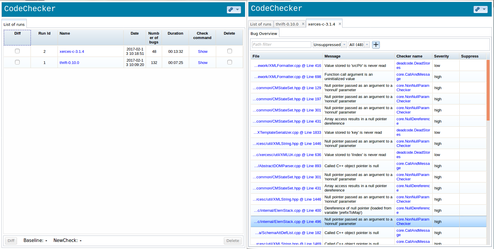
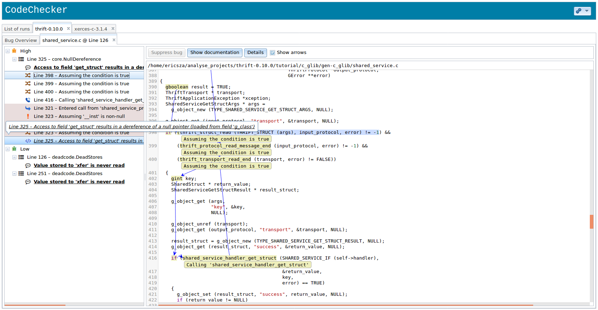

CodeChecker
===========

**CodeChecker** is a static analysis infrastructure built on the [LLVM/Clang
Static Analyzer](http://clang-analyzer.llvm.org) toolchain, replacing
[`scan-build`](http://clang-analyzer.llvm.org/scan-build.html) in a Linux or
macOS (OS X) development environment.

Main features
-------------

  * Support for multiple analyzers, currently _Clang Static Analyzer_ and
    _Clang-Tidy_
  * Store results of multiple large-scale analysis runs efficiently, either in
    a PostgreSQL or SQLite database
  * **Web application** for viewing discovered code defects with a streamlined,
    easy experience
  * **Filterable** (defect checker name, severity, source paths, ...) and
    **comparable** (calculates difference between two analyses of the project,
    showing which bugs have been fixed and which are newly introduced) result
    viewing
  * Subsequent analysis runs **only check** and update results for **modified
    files** without analysing the _entire_ project (depends on build toolchain
    support!)
  * Suppression of known false positive results, either in configuration file
    or via annotation in source code, along with exclusion of entire source
    paths from analysis
  * `quickcheck` mode shows analysis results on standard output
  * Easily implementable [Thrift](http://thrift.apache.org)-based
    server-client communication used for storing and querying of discovered
    defects
  * Support for multiple bug visualisation frontends, such as the web
    application, a [command-line tool](docs/usage.md) and an [Eclipse
    plugin](http://github.com/Ericsson/CodeCheckerEclipsePlugin)

A high-level overview about the infrastructure is available amongst the [2015
Euro LLVM Conference](http://llvm.org/devmtg/2015-04) presentations. 
**Dániel KRUPP, György ORBÁN, Gábor HORVÁTH and Bence BABATI**: 
[_Industrial Experiences with the Clang Static Analysis Toolset_](http://llvm.org/devmtg/2015-04/slides/Clang_static_analysis_toolset_final.pdf)

Install
-------

### Linux

For a detailed dependency list, please see [Requirements](docs/deps.md). The
following commands are used to bootstrap CodeChecker on Ubuntu 16.04.1 LTS:

~~~{.sh}
# Install mandatory dependencies for a development and analysis environment
# NOTE: clang-3.8 can be replaced by any later versions of LLVM/Clang
sudo apt-get install clang-3.8 build-essential curl doxygen gcc-multilib \
  git python-virtualenv python-dev thrift-compiler

# Check out CodeChecker
git clone https://github.com/Ericsson/CodeChecker.git --depth 1 ~/codechecker
cd ~/codechecker

# Create a Python virtualenv and set it as your environment
make venv
source $PWD/venv/bin/activate

# Build and install a CodeChecker package
make package

# For ease of access, add the build directory to PATH
export PATH="$PWD/build/CodeChecker/bin:$PATH"

cd ..
~~~

#### Upgrading environment after system or Python upgrade

If you have upgraded your system's Python to a newer version (e.g. from
`2.7.6` to `2.7.12` &ndash; this is the case when upgrading Ubuntu from
14.04.2 LTS to 16.04.1 LTS), the installed environment will not work
out-of-the-box. To fix this issue, run the following command to upgrade your
`checker_env` too:

~~~{.sh}
cd ~/codechecker/venv
virtualenv -p /usr/bin/python2.7 .
~~~

### Mac OS X

In OSX environment the intercept-build tool from [scan-build](https://github.com/rizsotto/scan-build)
is used to log the compiler invocations.

It is possible that the [intercept-build can not log](https://github.com/rizsotto/scan-build#limitations)
the compiler calls without turning off System Integrity Protection (SIP). `intercept build` can automatically detect if SIP is turned off.

You can turn off SIP on El Capitan this way:
  * Click the  (Apple) menu.
  * Select Restart...
  * Hold down command-R to boot into the Recovery System.
  * Click the Utilities menu and select Terminal.
  * Type csrutil disable and press return.
  * Close the Terminal app.
  * Click the  (Apple) menu and select Restart....

The following commands are used to bootstrap CodeChecker on OS X El Capitan 10.11.5 and macOS Sierra 10.12 Beta.

Check out and build LLVM/Clang with extra tools. Follow the [Get Started with
LLVM/Clang](http://clang.llvm.org/get_started.html) documentation.

~~~{.sh}
# Download and install dependencies
brew update
brew install doxygen gcc git
brew install homebrew/versions/thrift090

# Fetch source code
git clone https://github.com/Ericsson/CodeChecker.git --depth 1 ~/codechecker
cd ~/codechecker

# Create a Python virtualenv and set it as your environment
make venv
source $PWD/venv/bin/activate

# Build and install a CodeChecker package
make package

# For ease of access, add the build directory to PATH
export PATH="$PWD/build/CodeChecker/bin:$PATH"

cd ..
~~~

Check your first project
------------------------

### Configuring Clang version

_Clang_ and/or _Clang-Tidy_ must be available on your system before you can
run analysis on a project. CodeChecker automatically detects and uses the
latest available version in your `PATH`.

If you wish to use a custom `clang` or `clang-tidy` binary, e.g. because you
intend to use a specific version or a specific build, you need to configure
the installed CodeChecker package to use the appropriate binaries. Please edit
the configuration file
`~/codechecker/build/CodeChecker/config/package_layout.json`. In the
`runtime/analyzers` section, you must set the values, as shown below, to the
binaries you intend to use.

~~~{.json}
"analyzers" : {
  "clangsa" : "/path/to/clang/bin/clang-4.0",
  "clang-tidy" : "/path/to/clang/bin/clang-tidy-3.8"
},
~~~

### Setting up the environment in your Terminal

These steps must always be taken in a new command prompt you wish to execute
analysis in.

~~~{.sh}
source ~/codechecker/venv/bin/activate

# Path of CodeChecker package
# NOTE: SKIP this line if you want to always specify CodeChecker's full path
export PATH=~/codechecker/build/CodeChecker/bin:$PATH

# Path of `scan-build.py` (intercept-build)
# NOTE: SKIP this line if you don't want to use intercept-build
export PATH=~/{user path}/llvm/tools/clang/tools/scan-build-py/bin:$PATH

# Path of the built LLVM/Clang
# NOTE: SKIP this line if clang is available in your PATH as an installed Linux package
export PATH=~/{user path}/build/bin:$PATH
~~~

### Check the test project

Check your project using SQLite database. The database will be placed in your
workspace directory (`~/.codechecker` by default), which can be provided via
the `-w` flag.

    CodeChecker check -n test-check -b "cd ~/your-project && make clean && make"

### Start a web server

    CodeChecker server

### View results

Open the [CodeChecker Web Viewer](http://localhost:8001) in your browser, and
you should be greeted with a web application showing you the analysis results.

Important limitations with older Clang versions
-----------------------------------------------

CodeChecker requires some features from LLVM/Clang to work properly which are
not available in the `3.6` or earlier releases.

If your installed Clang does not support these features you will see the
following debug messages in your log:

> Check name wasn't found in the plist file.

 * Use clang `>= 3.7` or trunk `r228624` &mdash; otherwise CodeChecker makes
   a guess based on the report message.

> Hash value wasn't found in the plist file.

 * Use clang `>= 3.8` or trunk `r251011` &mdash; otherwise CodeChecker
   generates a simple hash based on the filename and the line content. This
   method is applied for Clang-Tidy results too, because Clang-Tidy does not
   support bug identifier hash generation currently.

Additional documentation
------------------------

  * [User guide](docs/user_guide.md)
  * [Requirements, external source dependencies](docs/deps.md)
  * [Architecture overview](docs/architecture.md)
  * [Package layout](docs/package_layout.md)
  * [Checker documentation](docs/checker_docs.md)
  * [Thrift interface](thrift_api/thrift_api.md)
  * [Package and integration tests](tests/functional/package_test.md)
  * [Database schema migration](docs/db_schema_guide.md)
  * [Usage of PostgreSQL database](docs/postgresql_setup.md)
  * [Requiring credentials to view analysis results](docs/authentication.md)
