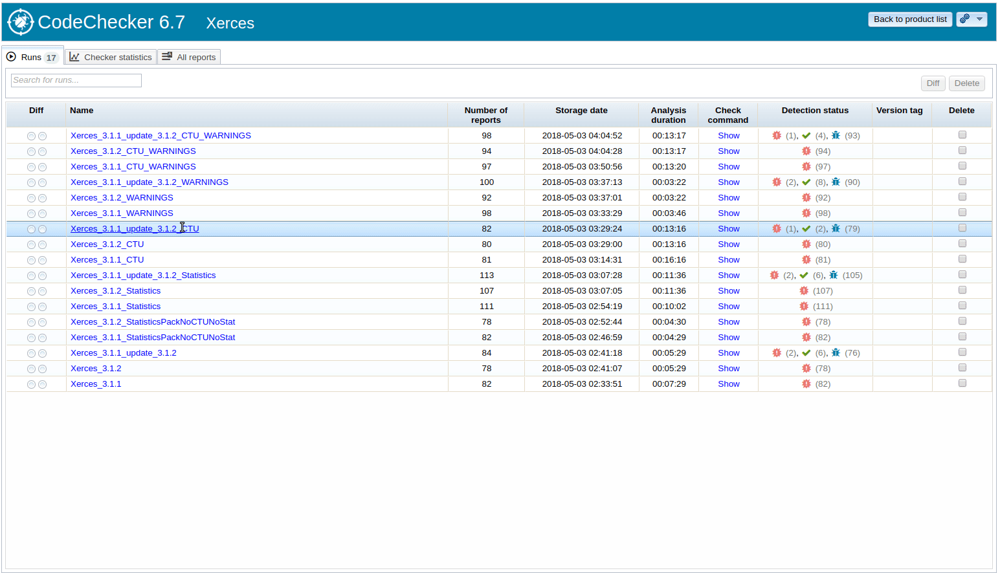
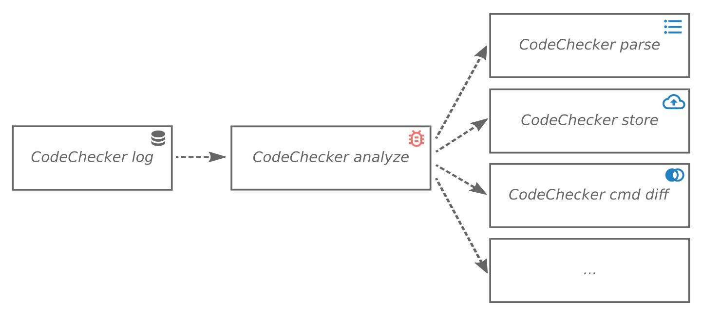
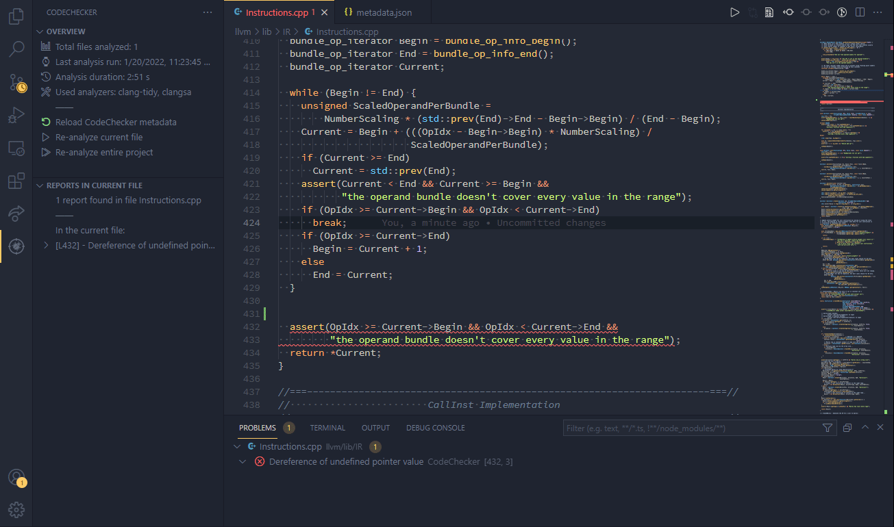
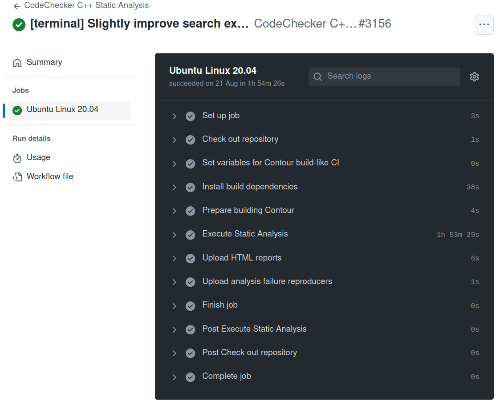

<h1 align="center">
  <br>
  
  <br>
  CodeChecker
  <br>
</h1>

<p align="center">
  <a href="https://github.com/Ericsson/codechecker/actions">
    
  </a>
  <a href="https://gitter.im/codecheckerHQ/Lobby?utm_source=share-link&utm_medium=link&utm_campaign=share-link">
    
  </a>
  <a href="https://codechecker.readthedocs.io/en/latest/?badge=latest">
    
  </a>
</p>

**CodeChecker** is a static analysis infrastructure built on the [LLVM/Clang
Static Analyzer](http://clang-analyzer.llvm.org) toolchain, replacing
[`scan-build`](http://clang-analyzer.llvm.org/scan-build.html) in a Linux or
macOS (OS X) development environment.



**:bulb: Check out our [DEMO](https://codechecker-demo.eastus.cloudapp.azure.com) showing some analysis results of open-source projects!**

# Main features
## Command line C/C++ Analysis
  * Executes [_Clang-Tidy_](http://clang.llvm.org/extra/clang-tidy/), [_Clang Static Analyzer_](http://clang-analyzer.llvm.org/) with Cross-Translation Unit analysis, Statistical Analysis (when checkers are available), and [_Cppcheck_](https://cppcheck.sourceforge.io/).
  * Creates the JSON compilation database by wiretapping any build process (e.g., `CodeChecker log -b "make"`).
  * Automatically analyzes GCC cross-compiled projects: detecting GCC or Clang compiler configuration and forming the corresponding clang analyzer invocations.
  * Incremental analysis: Only the changed files and its dependencies need to be reanalyzed.
  * False positive suppression with a possibility to add review comments.
  * Result visualization in command line or in static HTML.

## Web-based report storage
  * **You can store & visualize thousands of analysis reports** of many analyzers like
    Clang Static Analyzer (C/C++), Clang Tidy (C/C++), Facebook Infer (C/C++, Java), Clang Sanitizers (C/C++), Spotbugs (Java), Pylint (Python), Eslint (Javascript) ...  
    For a complete list see [Supported Analyzers](supported_code_analyzers.md)
  * **Web application** for viewing discovered code defects with a streamlined,
    easy experience (with PostgreSQL, or SQLite backend).
  * **Gerrit and GitLab integration** Shows analysis results as [GitLab](gitlab_integration.md) or [Gerrit](jenkins_gerrit_integration.md) reviews.
  * **Filterable** (defect checker name, severity, source paths, ...) and
    **comparable** (calculates difference between two analyses of the project,
    showing which bugs have been fixed and which are newly introduced) result
    viewing.
  * **Diff mode:** This shows the list of bugs that have been introduced since your last analyzer
    execution.
  * Results can be shared with fellow developers, the **comments** and
    **review** system helps communication of code defects.
  * Easily implementable [Thrift](http://thrift.apache.org)-based
    server-client communication used for storing and querying of discovered
    defects.
  * Support for multiple bug visualization frontends, such as the web
    application, a [command-line tool](usage.md) and an
    [Eclipse plugin](http://github.com/Ericsson/CodeCheckerEclipsePlugin).

## Command line features
`CodeChecker` command has many subcommands which can be used for example to
log and analyze your projects, print the results or start a web server. For
full list see the following table or check the help message of this command
(`CodeChecker --help`):

| `CodeChecker` subcommand | Description                                                                                   |
|--------------------------|-----------------------------------------------------------------------------------------------|
| `analyze`                | Execute the supported code analyzers for the files recorded in a JSON Compilation Database.   |
| `analyzer-version`       | Print the version of CodeChecker analyzer package that is being used.                         |
| `analyzers`              | List supported and available analyzers.                                                       |
| `check`                  | Perform analysis on a project and print results to standard output.                           |
| `checkers`               | List the checkers available for code analysis.                                                |
| `cmd`                    | View analysis results on a running server from the command line.                              |
| `fixit`                  | Apply automatic fixes based on the suggestions of the analyzers.                              |
| `log`                    | Run a build command, collect the executed compilation commands and store them in a JSON file. |
| `parse`                  | Print analysis summary and results in a human-readable format.                                |
| `server`                 | Start and manage the CodeChecker Web server.                                                  |
| `store`                  | Save analysis results to a database.                                                          |
| `version`                | Print the version of CodeChecker package that is being used.                                  |
| `web-version`            | Print the version of CodeChecker server package that is being used.                           |


`CodeChecker cmd` subcommand also has many other subcommands which can be used
to get data (products, runs, results, statistics) from a running CodeChecker
server. For full list see the following table or check the help message of this
subcommand (`CodeChecker cmd --help`):

| `CodeChecker cmd` subcommand | Description                                                                                       |
|------------------------------|---------------------------------------------------------------------------------------------------|
| `runs`                       | List the available analysis runs.                                                                 |
| `history`                    | Show run history of multiple runs.                                                                |
| `results`                    | List analysis result (finding) summary for a given run.                                           |
| `diff`                       | Compare two analysis runs and show the difference.                                                |
| `sum`                        | Show statistics of checkers.                                                                      |
| `token`                      | Access subcommands related to configuring personal access tokens managed by a CodeChecker server. |
| `del`                        | Delete analysis runs.                                                                             |
| `update`                     | Update an analysis run.                                                                           |
| `suppress`                   | Manage and import suppressions of reports on a CodeChecker server.                                |
| `products`                   | Access subcommands related to configuring the products managed by a CodeChecker server.           |
| `components`                 | Access subcommands related to configuring the source components managed by a CodeChecker server.  |
| `login`                      | Authenticate into CodeChecker servers that require privileges.                                    |
| `export`                     | Export comments and review statuses from CodeChecker.                                             |
| `import`                     | Import comments and review statuses into CodeChecker.                                             |


# Usage flow


- *Step 1*: `CodeChecker log` runs the given build command and records the
executed compilation steps. These steps are written to an output file
(Compilation Database) in a JSON format.
- *Step 2*: `CodeChecker analyze` uses the previously created JSON Compilation
Database to perform an analysis on the project, outputting analysis results in
a machine-readable (plist) format.
- *Step 3*: In this step, you can do multiple things:
    - Parse and pretty-print the summary and results from analysis result files
    (`CodeChecker parse`).
    - Store the results to a running CodeChecker server (`CodeChecker store`).
    - Compare two analysis results/runs to show the results that differ between
    the two (`CodeChecker cmd diff`).
    - etc.

For more information how to use CodeChecker see our [user guide](usage.md).

# User documentation

* [Getting started (How-To with examples)](usage.md)

## C/C++ Analysis
* [Analyzer User guide](analyzer/user_guide.md)
* [Avoiding or suppressing false positives](analyzer/false_positives.md)
* [Checker and Static Analyzer configuration](analyzer/checker_and_analyzer_configuration.md)
* [GCC incompatibilities](analyzer/gcc_incompatibilities.md)
* [Suppressing false positives](analyzer/user_guide.md#source-code-comments)

## Web based report management
* [Webserver User Guide](web/user_guide.md)
* [WEB GUI User Guide](/web/server/vue-cli/src/assets/userguide/userguide.md)
* [Command line and WEB UI Feature overview](feature_comparison.md)
* Security configuration 
  * [Configuring Authentication](web/authentication.md)
  * [Configuring Authorization](web/permissions.md)
* Deployment
  * [Deploy server using docker](web/docker.md#deployment)
* Server Configuration
  * [Configuring Server Logging](logging.md)
  * [Setting up multiple CodeChecker repositories in one server](web/products.md)
* Continuous Integration (CI)
  * [CodeChecker as a GitHub Action](http://github.com/marketplace/actions/codechecker-static-analysis)
  * [Setting up CI gating with Gerrit and Jenkins](jenkins_gerrit_integration.md)
* Database Configuration
  * [PostgreSQL database backend setup guide](web/postgresql_setup.md)
  * [CodeChecker server and database schema upgrade guide](web/db_schema_guide.md)

### Storage of reports from analyzer tools
CodeChecker can be used as a generic tool for visualizing analyzer results.

The following tools are supported:

| Language       | Analyzer                                                                     |
|----------------|------------------------------------------------------------------------------|
| **C/C++**      | [Clang Static Analyzer](https://clang-analyzer.llvm.org/)                    |
|                | [Clang Tidy](https://clang.llvm.org/extra/clang-tidy/)                       |
|                | [Clang Sanitizers](supported_code_analyzers.md#clang-sanitizers)             |
|                | [Cppcheck](/docs/tools/report-converter.md#cppcheck)                         |
|                | [Facebook Infer](/docs/tools/report-converter.md#facebook-infer)             |
|                | [Coccinelle](/docs/tools/report-converter.md#coccinelle)                     |
|                | [Smatch](/docs/tools/report-converter.md#smatch)                             |
|                | [Kernel-Doc](/docs/tools/report-converter.md#kernel-doc)                     |
|                | [Sparse](/docs/tools/report-converter.md#sparse)                             |
|                | [cpplint](/docs/tools/report-converter.md#cpplint)                           |
| **C#**         | [Roslynator.DotNet.Cli](/docs/tools/report-converter.md#roslynatordotnetcli) |
| **Java**       | [SpotBugs](/docs/tools/report-converter.md#spotbugs)                         |
|                | [Facebook Infer](/docs/tools/report-converter.md#facebook-infer)                    |
| **Python**     | [Pylint](/docs/tools/report-converter.md#pylint)                             |
|                | [Pyflakes](/docs/tools/report-converter.md#pyflakes)                         |
| **JavaScript** | [ESLint](/docs/tools/report-converter.md#eslint)                             |
| **TypeScript** | [TSLint](/docs/tools/report-converter.md#tslint)                             |
| **Go**         | [Golint](/docs/tools/report-converter.md#golint)                             |
| **Markdown**   | [Markdownlint](/docs/tools/report-converter.md#markdownlint)                 |
|                | [Sphinx](/docs/tools/report-converter.md#sphinx)                             |


For details see 
[supported code analyzers](supported_code_analyzers.md) documentation and the 
[Report Converter Tool](/docs/tools/report-converter.md).

## Common Tools
Useful tools that can also be used outside CodeChecker.

* [Build Logger (to generate JSON Compilation Database from your builds)](/analyzer/tools/build-logger/README.md)
* [Plist to HTML converter (to generate HTML files from the given plist files)](/docs/tools/report-converter.md#plist-to-html-tool)
* [Report Converter Tool (to convert analysis results from other analyzers to the codechecker report directory format))](/docs/tools/report-converter.md)
* [Translation Unit Collector (to collect source files of a translation unit or to get source files which depend on the given header files)](/docs/tools/tu_collector.md)
* [Report Hash generator (to generate unique hash identifiers for reports)](/docs/tools/report-converter.md#report-hash-generation-module)

## Helper Scripts
* [Helper Scripts for daily analysis](script_daily.md)

# Install guide

## Install CodeChecker via `pip`
CodeChecker is available on the [pypi](https://pypi.org/project/codechecker/)
and can be installed with the following command:
```sh
pip3 install codechecker
```

**Note:** this package can be installed on `Linux`, `OSX` and `Windows`
systems where `pip3` command is available. On `OSX`, `intercept-build` must be
installed for logging (`CodeChecker log`). On `Windows`, logging is not
available.

## Installing CodeChecker via the `snap` package manager
CodeChecker is available on the [Snap Store](https://snapcraft.io/codechecker)
and can be installed with the following command:
```sh
sudo snap install codechecker --classic
```

**Note:** Unfortunately, the snap package supports only lower-case command names.
For this reason, you need to use `codechecker` command instead of `CodeChecker`
everywhere. For a full list of available commands in the _codechecker_ snap
package, run `snap info codechecker`.

## Linux

For a detailed dependency list, and for instructions on how to install newer
Clang and Clang-Tidy versions, please see [Requirements](deps.md).
The following commands are used to bootstrap CodeChecker on Ubuntu 20.04 LTS:

```sh
# Install mandatory dependencies for a development and analysis environment.
# NOTE: clang or clang-tidy can be any sufficiently fresh version, and need not
#       come from package manager!
#       In case of Cppcheck, the minimal supported version is 1.80.
sudo apt-get install clang clang-tidy cppcheck build-essential curl gcc-multilib \
      git python3-dev python3-venv python3-setuptools

# Install nodejs dependency for web. In case of Debian/Ubuntu you can use the
# following commands. For more information see the official docs:
# https://nodejs.org/en/download/package-manager/
curl -sL https://deb.nodesource.com/setup_16.x | sudo -E bash -
sudo apt-get install -y nodejs

# Check out CodeChecker source code.
git clone https://github.com/Ericsson/CodeChecker.git --depth 1 ~/codechecker
cd ~/codechecker

# Create a Python virtualenv and set it as your environment.
# NOTE: if you want to develop CodeChecker, use the `venv_dev` target instead
# of `venv`.
make venv
source $PWD/venv/bin/activate

# [Optional] If you want to use external authentication methods (LDAP / PAM)
# follow the instructions in
# docs/web/authentication.md#external-authentication-methods

# Build and install a CodeChecker package.
make package

# For ease of access, add the build directory to PATH.
export PATH="$PWD/build/CodeChecker/bin:$PATH"

cd ..
```

**Notes**:
- By default, `make package` will build ldlogger shared objects for
`32bit` and `64bit` too. If you would like to build and package `64 bit only`
shared objects and ldlogger binary you can set `BUILD_LOGGER_64_BIT_ONLY`
environment variable to `YES` before the package build:
`BUILD_LOGGER_64_BIT_ONLY=YES make package`.
- By default, the `make package` will build the UI code if it's not built yet
or the UI code is changed. If you wouldn't like to build the UI code you can
set the `BUILD_UI_DIST` environment variable to `NO` before the package build:
`BUILD_UI_DIST=NO make package`.
- Use `make standalone_package` instead of `make package` to avoid
having to manually activate the environment before running CodeChecker.

### Upgrading environment after system or Python upgrade

If you have upgraded your system's Python to a newer version (e.g., from
`2.7.6` to `2.7.12` &ndash; this is the case when upgrading Ubuntu from
14.04.2 LTS to 16.04.1 LTS), the installed environment will not work
out-of-the-box. To fix this issue, run the following command to upgrade your
`checker_env` too:

```sh
cd ~/codechecker/venv
python3 -m venv .
```

## Mac OS X
For installation instructions for Mac OS X see [Mac OS X Installation Guide](install_macosx.md) documentation.

## Docker
To run the CodeChecker server in Docker see the [Docker](web/docker.md) documentation.
You can find the CodeChecker web-server container at the [Docker Hub](https://hub.docker.com/r/codechecker/codechecker-web).


## Visual Studio Code plugin


You can install and use CodeChecker VSCode extension from the
[Visual Studio Marketplace](http://marketplace.visualstudio.com/items?itemName=codechecker.vscode-codechecker)
or from [Open VSX](http://open-vsx.org/extension/codechecker/codechecker).

Main features:
- Run CodeChecker analysis from the editor and see the results automatically.
- Re-analyze the current file when saved.
- Commands and build tasks for running CodeChecker as part of a build system.
- Browse through the found reports and show the reproduction steps directly in the code.
- Navigate between the reproduction steps.



For more information how to install and use this plugin see the
[repository](https://github.com/Ericsson/codecheckervsCodePlugin/) of this
extension.

## GitHub Actions CI



CodeChecker can be executed via a reusable GitHub action for your project!
You need only specify the build command, as if you would run the analysis
locally.

For more information, check out the
[CodeChecker Static Analysis](http://github.com/marketplace/actions/codechecker-static-analysis)
action on the GitHub Actions Marketplace.

# Analyze your first project

## Setting up the environment in your Terminal

These steps must always be taken in a new command prompt you wish to execute
analysis in.

```sh
source ~/codechecker/venv/bin/activate

# Path of CodeChecker package
# NOTE: SKIP this line if you want to always specify CodeChecker's full path.
export PATH=~/codechecker/build/CodeChecker/bin:$PATH

# Path of the built LLVM/Clang
# NOTE: SKIP this line if clang is available in your PATH as an installed Linux package.
export PATH=~/<user path>/build/bin:$PATH
```
## Execute analysis

Analyze your project with the `check` command:

    CodeChecker check -b "cd ~/your-project && make clean && make" -o ./results

`check` will print an overview of the issues found in your project by the
analyzers. The reports will be stored in the `./results` directory in `plist` 
XML format.

## Export the reports as static HTML files
You can visualize the results as static HTML by executing

`CodeChecker parse -e html ./results -o ./reports_html`

An index page will be generated with a list of all repors in 
`./reports_html/index.html` 


## Optionally store the results in Web server & view the results

If you have hundreds of results, you may want to store them on the web
server with a database backend.

Start a CodeChecker web and storage server in another terminal or as a
background process. By default, it will listen on `localhost:8001`.

The SQLite database containing the reports will be placed in your workspace
directory (`~/.codechecker` by default), which can be provided via the `-w`
flag.

    CodeChecker server

Store your analysis reports onto the server to be able to use the Web Viewer.

    CodeChecker store ./results -n my-project

Open the [CodeChecker Web Viewer](http://localhost:8001) in your browser, and
you should be greeted with a web application showing you the analysis results.

# Important environmental limitations

## Python 2 and older Python 3 releases

CodeChecker has been ported completely to Python **3**.
**No Python 2 support is planned.**
You will need at least Python version **`3.8`**.
Old virtual environments that were created with a Python 2 interpreter need to
be removed.

### Upgrading environment after system or Python upgrade

If you have upgraded your system's Python to a newer version (e.g., from
`2.7` to `3.8` &ndash; this is the case when upgrading Ubuntu from 14.04 LTS
to 20.04 LTS), the installed environment will not work out-of-the-box. To fix
this issue, run the following command to upgrade your `checker_env` too:

```sh
cd ~/codechecker/venv
python3 -m venv .
```


## Older Clang versions

Clang `3.6` or earlier releases are **NOT** supported due to CodeChecker
relying on features not available in those releases.

If you have Clang `3.7` installed you might see the following warning message:

> Hash value wasn't found in the plist file.

Use Clang `>= 3.8` or SVN trunk `r251011` / Git commit
[`efec163`](http://github.com/llvm/llvm-project)  &mdash; otherwise,
CodeChecker generates a simple hash based on the filename and the line content.
This method is applied for Clang-Tidy results too, because Clang-Tidy does not
support bug identifier hash generation currently.


## Developer documentations
* [Architecture](architecture.md)
* [Package layout](package_layout.md)
* [Dependencies](deps.md)
* [Thrift interface](web/api/README.md)
* [Package and integration tests](tests.md)
* [Checker documentation mapping file](web/checker_docs.md)

## Conference papers, presentations
* An overview about the CodeChecker infrastructure was given at [PLDI 2020](http://pldi20.sigplan.org).<br />
  **Márton, Gábor and Krupp, Dániel**:<br />
  [_Tool Talk: CodeChecker_](http://youtube.com/watch?v=bVqrhaoxHlc)
* A high-level overview about the infrastructure is available amongst the
  [2015 Euro LLVM Conference](http://llvm.org/devmtg/2015-04) presentations.<br/>
  **Krupp, Dániel and Orbán, György and Horváth, Gábor and Babati, Bence**:<br/>
  [_Industrial Experiences with the Clang Static Analysis Toolset_](http://llvm.org/devmtg/2015-04/slides/Clang_static_analysis_toolset_final.pdf)
