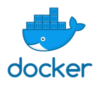

# Docker
Docker provides a way to run applications securely isolated in a container,
packaged with all its dependencies and libraries.

 [](https://hub.docker.com/r/codechecker/codechecker-web)

To see how you can run CodeChecker analysis in Docker read the following
sections.

## Table of Contents
* [Build Docker image](#build-docker-image)
* [Pre-built CodeChecker Docker images](#pre-built-codechecker-docker-images)
* [Usage](#usage)

## Build Docker image
You can create a Docker image by running the following command in the root
directory of this repository:
```bash
docker build -t codechecker-analyzer:latest analyzer/docker
```

Multiple build-time variables can be specified:

- `CC_VERSION` (default: *master*): branch or tag version which will be cloned
from Git. Use `master` if you would like to build an image from the latest
CodeChecker.
- `CC_UID` (default: *950*): id of the *codechecker* user which will be created
during the image build and which will be used to run analysis.
- `CC_GID` (default: *950*): id of the *codechecker* group which will be
created during the image build.

Example:
```bash
docker build \
  --tag codechecker-analyzer:latest analyzer/docker
```


## Pre-built CodeChecker Docker images
You can use our pre-built Docker images which can be found in the
[Docker Hub](https://hub.docker.com/r/codechecker/codechecker-analyzer).

## Usage

The Docker image exposes the built `CodeChecker` analyzer package, however, by
itself, it's not immediately usable to analyze most of the projects, as the
project-specific dependencies are missing.

The image is useful for a baseline to create an image for your project:

```Dockerfile
# Set the base image for your project.
FROM codechecker/codechecker-analyzer:latest

# Install the project dependencies.
RUN apt-get update -qq && apt-get install -qqy g++

# Let us assume your project will be mounted at /project.
WORKDIR /project
```

Create your appropriate `Dockerfile` and build the dependencies:

```sh
docker build -t myproject:latest .
```

After building your project-specific image that contains your system
dependencies, you can run the analysis:

```sh
docker run \
  -v /home/$USER/projects/myproject:/project \
  -v /home/$USER/codechecker_results:/workspace \
  myproject:latest \
    CodeChecker check --build "make -j$(nproc)"
```

