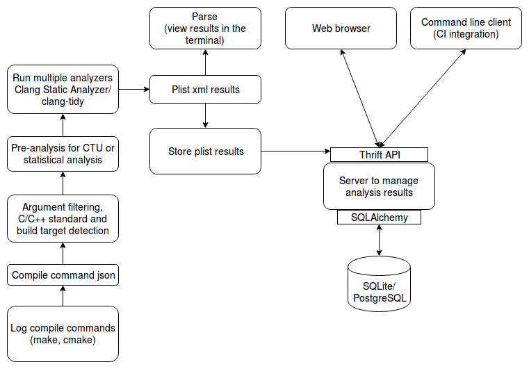

# Architecture overview

## Table of Contents

- [Log compilation commands](#log-compile-cmd)
- [Process compilation commands](#process-compile-cmd)
- [Pre analysis for Cross Translation Unit or statistical analysis](#pre-analysis)
    - [Cross Translation Unit analysis](#ctu)
    - [Statistical analysis](#statistical)
- [Run the analysis](#run-the-analysis)
- [Report storage and viewer server](#report-storage-viewer-server)
- [Database](#database)
- [Command line client](#cmdline)
- [Web browser client](#browser)

## Log compilation commands 

Generate a Compilation database (in json format) which can be processed by CodeChecker.
Buildlogger is built-in CodeChecker. Generating the compilation database can be automatically done.

## Process compilation commands 

The g++ logged compilation commands need to be modified before they can be forwarded to the clang compiler for static analysis.
- non compatible compilation arguments needs to be filtered out.
- C/C++ standard needs to detected if the compilation command does not contain it.
- compilation target needs to be detected if the compilation command does not contain it in case of cross-compilation.
- gcc/g++ hardcoded include paths needs to be collected used during the analysis.

## Pre analysis for Cross Translation Unit or statistical analysis 

Pre analysis step is only required for CTU or statistical type of analysis.

### Cross Translation Unit analysis 

For CTU analysis the ast dumps for each compilation action needs to be generated. This is done as a pre analysis step. The emitted information can be used at the actual static analysis step by the Clang Static Analyzer.

### Statistical analysis 

Various information can be collected about the source code (return value checks, ...) in this step which can be reused during the actual static analysis step.

## Run the analysis 

Multiple analyzers run parallel using the collected information in the pre analysis step if available.
  - processes one Buildaction
  - constructs the analysis command
  - runs the static analyzer analyzer
  - postprocesses analysis results if required
  - collect failure information in case the analysis failed (compilation error or crash)

The result of the analysis are multiple plist xml files containing the analyzer results.

## Report Storage and viewer server 

- Provides a Thrift API to store and query the analysis results.
- Detects duplicate results (result in header file detected by multiple analyzer runs).
- Each source file is stored only once.
- Uses SQLAlchemy to connect to a database backend.
- Manage multiple Products (each product can be in a separate database).
- Handle user authentication (LDAP ...)
- Multiple clients can connect simultaneously to store or query the results.
- Provides a simple https webserver to view documentation.

## Database 

- Configuration database:
  - authentication/session information
  - product configuration (database connection information ...)
- Report database:
  - Store multiple analyzer run results.
  - Data can be used to generate analysis statistics.

## Command line client 

- Can be used for CI integration in a jenkins job.
- Simple client to view/compare results.
- Can be used for automated scripts for result processing.
- Provides multiple output types (plaintext, json, csv).

## Web browser client 

- Client to view/filter/compare analysis results.
- Results are dynamically rendered based on the database content.
