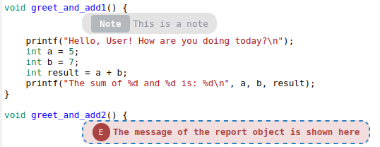
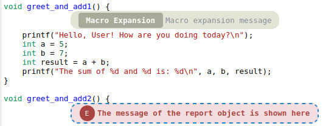
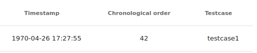

# Static/Dynamic Analsyis Plist Format Specification

Plist files are used in CodeChecker to store and parse diagnostic 
information from static analysis tools.
This documentation explains the structure of plist files parsed by 
CodeChecker, illustrating how they are represented in the code and what 
they look like on the CodeChecker UI.

## Table of Contents
* [Plist files in CodeChecker](#plist-files-in-codechecker)
* [Structure of a .plist File](#structure-of-a-plist-file)
* [Diagnostic Entry Examples](#diagnostic-entry-examples)
  * [1. `path` — Bug Path Events](#1-bug_path_event--bug-path-events)
  * [2. `notes` — Notes](#2-notes--notes)
  * [3. `macro_expansions` — Macro Expansions](#3-macro_expansions--macro-expansions)
  * [4. `report-annotation` — Report Annotations](#4-report-annotation--report-annotations)
* [License](#license)


## Plist files in CodeChecker

Plist is the default static and dynamic analysis inter-change file format of 
CodeChecker. They are created as a results of the analysis: 
`CodeChecker analyze -o report_directory` invocation in the report directory. 
The proprietary report format of each invoked analyzer tool is converted into 
`plist` format by the report-converter tools. Then, these `plist` reports are 
consumed by the `CodeCheckecker store/diff/parse` subcommands.

Plist files are produced by the [report-converter](./report-converter.md) in 
CodeChecker from the analyzer outputs. They are used to store and parse 
diagnostic information from 
static analysis tools. For usage, parameters, and supported analyzers of 
the report-converter, refer to the [relevant documentation file](./report-converter.md).

## Structure of a .plist File

### Example Structure

```xml
<plist version="1.0">
<dict>
	<key>diagnostics</key>
	<array>
		<dict>
			<key>category</key>
			<string>unknown</string>
			<key>check_name</key>
			<string>division-by-zero</string>
			<key>description</key>
			<string>The message of the report object is shown here</string>
			<key>issue_hash_content_of_line_in_context</key>
			<string>...</string>
			<key>location</key>
			<dict>
				<key>col</key>
				<integer>42</integer>
				<key>file</key>
				<integer>0</integer>
				<key>line</key>
				<integer>8</integer>
			</dict>
			<key>path</key>
			<array>
				...
			</array>
			<key>type</key>
			<string>report-converter-type</string>
		</dict>
	</array>
	<key>files</key>
	<array>
		<string>files/file.cpp</string>
	</array>
	<key>metadata</key>
	<dict>
		<key>analyzer</key>
		<dict>
			<key>name</key>
			<string>...</string>
		</dict>
		<key>generated_by</key>
		<dict>
			<key>name</key>
			<string>converter</string>
			<key>version</key>
			<string>x.y.z</string>
		</dict>
	</dict>
</dict>
</plist>
```

#### Possible `<key>`s of the plist file

 - `category:string` The category of the checker which emitted the report. 
 Currently unused by the CodeChecker tooling.
 - `check_name:string` The name of the checker which emitted the report. This 
 checker name is visualized in the GUI and used in the report suppressions.
 - `description:string` The short description of the analysis report.
 - `issue_hash_content_of_line_in_context:string` Unique hash of the entry 
 generated based on the properties of the report (location, check_name, 
 description).
 - `location:dict`
    - `col:integer` Position of the line of the file the entry applies to.
    - `file:integer` Enumerated value of the file the entry applies to. 
    The corresponding files are listed under the `files` key. The indexing of 
    these files start from 0.
    - `line:integer` Line of the file the entry applies to.
 - `files:string[]` File paths referenced in the location (e.g. source 
 files, headers). Can contain relative and absolute paths. Absolute paths 
 must start with `/`.
 - `metadata:dict`
    - `analyzer:dict`
      - `name:string` The name of the analyzer tool or engine used.
    - `generated_by:dict` Information about the tool that generated the plist.
      - `name:string` Name of the generating tool (e.g. report-converter or 
      CodeChecker analyzer)
      - `version:string` Version of the generating tool

Note: key-value pairs can be in any order per the plist specification.


### Structure of an Empty .plist File

```xml
<plist version="1.0">
<dict>
	<key>diagnostics</key>
	<array>
	</array>
	<key>files</key>
	<array>
	</array>
</dict>
</plist>
```

---

## Diagnostic Entry Examples

The `.plist` file may contain the following kinds of entries:

### 1. `path` — Bug Path Events

Bug Path Events are the core of how CodeChecker explains the progression of an 
issue in the code. They show what happened at each step that led to the 
reported bug, in a step-by-step trace.

```xml
<key>path</key>
<array>
  <dict>
    <key>edges</key>
    <array>
      <dict>
        <key>end</key>
        <array>
          <dict>
            <key>col</key>
            <integer>1</integer>
            <key>file</key>
            <integer>1</integer>
            <key>line</key>
            <integer>3</integer>
          </dict>
          <dict>
            <key>col</key>
            <integer>1</integer>
            <key>file</key>
            <integer>1</integer>
            <key>line</key>
            <integer>3</integer>
          </dict>
        </array>
        <key>start</key>
        <array>
          <dict>
            <key>col</key>
            <integer>1</integer>
            <key>file</key>
            <integer>0</integer>
            <key>line</key>
            <integer>19</integer>
          </dict>
          <dict>
            <key>col</key>
            <integer>1</integer>
            <key>file</key>
            <integer>0</integer>
            <key>line</key>
            <integer>19</integer>
          </dict>
        </array>
      </dict>
    </array>
    <key>kind</key>
    <string>control</string>
  </dict>
  <dict>
    <key>depth</key>
    <integer>0</integer>
    <key>kind</key>
    <string>event</string>
    <key>location</key>
    <dict>
      <key>col</key>
      <integer>1</integer>
      <key>file</key>
      <integer>0</integer>
      <key>line</key>
      <integer>19</integer>
    </dict>
    <key>message</key>
    <string>First bug path event</string>
  </dict>
  <dict>
    <key>depth</key>
    <integer>0</integer>
    <key>kind</key>
    <string>event</string>
    <key>location</key>
    <dict>
      <key>col</key>
      <integer>1</integer>
      <key>file</key>
      <integer>1</integer>
      <key>line</key>
      <integer>3</integer>
    </dict>
    <key>message</key>
    <string>Second bug path event</string>
  </dict>
</array>
```
#### `<key>`s of the Bug Path Event (`<path>`)

 - `edges:dict[]`  Describes a transition between source locations. 
 Each edge dictionary contains:
  - `start:dict[]`
    - `col:integer` Position of the line of the file the entry applies to.
    - `file:integer` Enumerated value of the file the entry applies to. 
    The corresponding files are listed under the `files` key 
    ([see above](#possible-keys-of-the-plist-file)). The indexing of these 
    files start from 0.
    - `line:integer` Line of the file the entry applies to.
  - `end:dict[]`
    - `col:integer` Position of the line of the file the entry applies to.
    - `file:integer` Enumerated value of the file the entry applies to. 
    The corresponding files are listed under the `files` key 
    ([see above](#possible-keys-of-the-plist-file)). The indexing of these 
    files start from 0.
    - `line:integer` Line of the file the entry applies to.
 - `depth:integer` depth key is included in the file, but currently not used.
 - `kind:string` Specifies the type of the entry. Values used in CodeChecker 
plists include:
    - `event` Represents an analyzer-reported event, typically accompanied by a 
    a descriptive message explaining what the analyzer's finding at that point 
    in the code.
    - `control` Represents a change in control flow, such as moving from one 
    line of code to another.
 - `location:dict`
    - `col:integer` Position of the line of the file the entry applies to.
    - `file:integer`  Enumerated value of the file the entry applies to. 
    The corresponding files are listed under the `files` key 
    ([see above](#possible-keys-of-the-plist-file)). The indexing of these 
    files start from 0.
    - `line:integer` Line of the file the entry applies to.
 - `message:string`  A human-readable description of the event, explaining the 
 analyzer-reported event.

Note: the start and end locations in the above example might be dicts instead 
of arrays of dicts.

#### UI Representation:


Navigating through Bug Path Events is possible by using “Previous” and “Next” 
buttons. This makes it easy to step through the logical flow that triggered 
the bug - even when it spans across multiple files.

In the user interface, each Bug Path Event is displayed as a blue text bubble 
with a sequence number, indicating the order in which the analyzer followed 
the steps. The final event in the path is highlighted in red to distinguish it 
as the primary point of failure.

If two consecutive bug path events occur in the same file, the UI will draw an 
arrow in the code viewer pane, pointing from one event to the next.
These arrows help visually trace how the issue progresses through the code.

Arrow visibility can be turned on/off in the UI settings.

### 2. `notes` — Notes

```xml
<key>notes</key>
<array>
  <dict>
    <key>location</key>
    <dict>
      <key>col</key>
      <integer>15</integer>
      <key>file</key>
      <integer>0</integer>
      <key>line</key>
      <integer>3</integer>
    </dict>
    <key>message</key>
    <string>This is a note</string>
  </dict>
</array>
```

#### UI Representation:



### 3. `macro_expansions` — Macro Expansions

```xml
<key>macro_expansions</key>
<array>
  <dict>
    <key>expansion</key>
    <string>Macro expansion message</string>
    <key>location</key>
    <dict>
      <key>col</key>
      <integer>15</integer>
      <key>file</key>
      <integer>1</integer>
      <key>line</key>
      <integer>3</integer>
    </dict>
    <key>name</key>
    <string>Macro name which will be expanded.</string>
  </dict>
</array>
```

#### UI Representation:



### 4. `report-annotation` — Report Annotations

Report Annotations are a special kind of metadata associated with reports in 
CodeChecker. They were originally introduced to incorporate dynamic analysis 
tools better, where additional contextual data is useful. However, 
Report Annotations can be associated with any Report, including the ones
generated by static analysis tools.

Supported report-annotations for storing dynamic analysis results:
- **`timestamp`** (`date-time`, ISO 8601): Timestamp when the issue was 
generated, recorded, or annotated
- **`testcase`** (`string`): Customizable name of the Testcase. When recording 
dynamic analysis executions, the reports can be associated to Testcases during 
which the report occurred.
- **`chronological_order`** (`int`): Sequence number of the issue. In dynamic 
analysis, the order of issues are important. With the chronological order 
field, the order of dynamic analysis events can be recorded.

```xml
<key>report-annotation</key>
<dict>
  <key>chronological_order</key>
  <integer>42</integer>
  <key>testcase</key>
  <string>testcase1</string>
  <key>timestamp</key>
  <string>1970-04-26T17:27:55</string>
</dict>
```

#### UI Representation:



Report annotations appear as metadata columns in the Reports table.

---

## License

The project is licensed under Apache License v2.0 with LLVM Exceptions.
See LICENSE.TXT for details.
