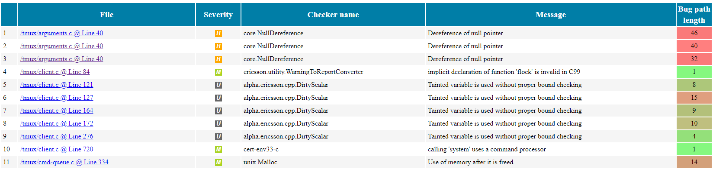

# CodeChecker HOWTO

This is lazy dog HOWTO to using CodeChecker analysis.
It invokes Clang Static Analyzer and Clang-Tidy tools to analyze your code.

## Table of Contents
- CodeChecker HOWTO
  - [Table of Contents](#table-of-contents)
  - [Preface](#preface)
  - [Step 0:](#step-0)
  - [Step 1: Integrate CodeChecker into your build system](#step-1)
    - [Step in the docs/examples directory](#step-in)
    - [Clean the workspace](#clean-workspace)
    - [Log your build](#log-your-build)
    - [Check the contents of compile_commands.json file](#check-compile-commands)
  - [Step 2: Analyze your code](#step-2)
    - [Run the analysis](#run-the-analysis)
    - [View the analysis results in the command line](#view-analysis-results)
    - [Cross-Compilation](#cross-compilation)
  - [Step 3: View analysis results in command line or generate static HTML files](#step-3)
  - [Step 4: Incremental Analysis](#step-4)
    - [Automatic fixing](#automatic-fixing)
      - [Using incremental build on modified files](#using-incremental-build)
      - [Using skip file to narrow analyzed files](#narrow-files)
      - [Analyze explicitly selected source files from the compilation database](#analize-explicit-files)
  - [Step 5: Cross Translation Unit analization](#step-5)
  - [Step 6: Store analysis results in a CodeChecker DB and visualize results](#step-6)
    - [Definition of "run"](#run-definition)
    - [Programmer checking new bugs in the code after local edit (and compare it to a central database)](#compare)
    - [Using diff command on the local filesystem](#using-diff)
  - [Step 7: Fine tune Analysis configuration](#step-7)
    - [Analysis Failures](#analysis-failures)
    - [Avoiding or Suppressing False positives](#false-positives)
    - [Ignore modules from your analysis](#ignore-modules)
    - [Enable/Disable Checkers](#enable-disable-checkers)
    - [Configure Checkers](#configure-checkers)
    - [Identify files that failed analysis](#identify-files)
  - [Step 8: Integrate CodeChecker into your CI loop](#step-8)
    - [Storing & Updating runs](#storing-runs)
      - [Alternative 1 (RECOMMENDED): Store the results of each commit in the same run](#storeing-results)
      - [Alternative 2: Store each analysis in a new run](#storing-new-runs)
    - [Gerrit Integration](#gerrit-integration)
    - [Setting up user authentication](authentication)
  - [Updating CodeChecker to new version](#upgrade)
- [Unique Report Identifier (RI)](#unique-report-identifier)
  - [Listing and Counting Reports](#listing-reports)
    - [How reports are counted?](#how-report-are-counted)
  - [Report Uniqueing](#report-uniqueing)
  - [How diffs between runs are calculated?](#diffs-between-runs)

## Preface <a name="preface"></a>
The purpose of this document is to make the developer's first steps easier in
usage of CodeChecker. The document is a mini course with simple examples that
guides the developer how he/she can apply CodeChecker in his/her daily routine
to make his/her code more roubust.

There is a simple [example](examples) program in this repository what will be
used in the later sections to show CodeChecker usage.

## Step 0: <a name="step-0"></a>
There are some prerequisite to successfully take this example:
- [Install](README.md/#install-guide) CodeChecker. 
- Install analyzer binaries: `clang` / `clang-tidy` (on debian based systems update-alternatives is your friend).
- Install `gcc` and `make` to compile our example project.
- Install Python 3 (> 3.6)

## Step 1: Integrate CodeChecker into your build system <a name="step-1"></a>
CodeChecker analyzes sources and dependencies that are built by your
build system.

### Step in the docs/examples directory <a name="step-in"></a>
```sh
cd <repo root dir>/docs/examples
```

### Clean the workspace <a name="clean-workspace"></a>
```sh
make clean
```

### Log your build <a name="log-your-build"></a>
Logging means that during the whole compilation process CodeChecker catches
compiler calls and saves commands in a
[compilation database](https://clang.llvm.org/docs/JSONCompilationDatabase.html)
file. This compilation database is an input of the next analysis step.

```sh
CodeChecker log --build "make" --output ./compile_commands.json
```

### Check the contents of compile_commands.json file <a name="check-compile-commands"></a>
If everything goes well it should contain the C compiler calls (`gcc`, `clang`,
etc.).

```sh
cat ./compile_commands.json
```

**What to do if the `compile_commands.json` is empty?**
In this case a debug log file is generated beside the `compile_commands.json`
(named codechecker.logger.debug) and if the compilation database is empty maybe
it will contain much information about this.

* Make sure that your build system actually invoked the compiler (e.g. `gcc`,
`g++`, `clang`).
  In case your software was built once (and the binaries are already
  generated), the compiler will not be invoked. In this case do a build
  cleanup (e.g. `make clean`) and retry to log your build.
* Make sure that the `CC_LOGGER_GCC_LIKE` environment variable is set correctly
  and contains your compilers. For detailed description see the
  [user guide](analyzer/user_guide.md#log).
* MacOS users need `intercept-build` to be available on the system,
  and in most cases, _System Integrity Protection_ needs to be turned off.
  See the [README](/README.md#mac-os-x) for details.

## Step 2: Analyze your code <a name="step-2"></a>
Once the build is logged successfully and the `compile_commands.json` was
created, you can analyze your project.

### Run the analysis <a name="run-the-analysis"></a>
```sh
CodeChecker analyze ./compile_commands.json --enable sensitive --output ./reports
```

However the compilation of the project (here the example program) is performed
by `gcc`, the CodeChecker uses `clang` to analyze sources of the project.
During analysis, CodeChecker compiles/analyses sources again. The analysis
process generally uses more time. If you want to speed up analysis specify a
higher value for the `--jobs` option.

In the above command the `--enable sensitive` means that a subset of checker
are run. `sensitive` chooses a predefined "group" of checkers. The further
info on available checkers use

```sh
# List available checkers.
CodeChecker checkers --help
# Show more information about the checkers.
CodeChecker checkers --details --help
# List profiles.
CodeChecker checkers --profile list --details
# List checkers which are in the sensitive profile.
CodeChecker checkers --profile sensitive --details
```
commands.

The `./reports` directory is the "database" of CodeChecker that allows to
manage further working steps.

### View the analysis results in the command line <a name="view-analysis-results"></a>
```sh
CodeChecker parse ./reports
```

Hint:
You can do the 1st and the 2nd step in one round by executing `check`
```sh
cd <repo root dir>/docs/examples
make clean
CodeChecker check --build "make" --output ./reports --clean \
    --enable sensitive
```
or to run on 22 threads both the compilation and the analysis:

```sh
CodeChecker check --jobs 22 --build "make clean ; make --jobs 22" \
    --output ./reports --clean --enable sensitive
```

### Cross-Compilation <a name="cross-compilation"></a>
Cross-compilers are auto-detected by CodeChecker, so the `--target` and the
compiler pre-configured include paths of `gcc/g++` are automatically passed to
`clang` when analyzing.

**Make sure that the compilers used for building the project (e.g.
`/usr/bin/gcc`) are accessible when `CodeChecker analyze` or `check` is
invoked.**

## Step 3: View analysis results in command line or generate static HTML files <a name="step-3"></a>
You can print detailed results (including the control flow) in command line by
running:

```sh
CodeChecker parse --print-steps ./reports
...
Found no defects in divide.c
[MEDIUM] src/main.c:17:9: function 'strcmp' is called without explicitly comparing result [bugprone-suspicious-string-compare]
    if (strcmp(argv[1], "all")) {
        ^
  Report hash: c60704d2b3d5069c975c269a0cbd03c7
  Steps:
    1, main.c:17:32: != 0 (fixit)
    2, main.c:17:9: function 'strcmp' is called without explicitly comparing result

[MEDIUM] src/main.c:17:9: variable 'result' is used uninitialized whenever 'if' condition is false [clang-diagnostic-sometimes-uninitialized]
    if (strcmp(argv[1], "all")) {
        ^
  Report hash: 21f2edcb80d0c1eb26bc1afc0eaf5e61
  Steps:
    1, main.c:23:17: uninitialized use occurs here
    2, main.c:17:5: remove the 'if' if its condition is always true
    3, main.c:10:16: initialize the variable 'result' to silence this warning
    4, main.c:17:9: variable 'result' is used uninitialized whenever 'if' condition is false

[HIGH] src/main.c:23:5: Undefined or garbage value returned to caller [core.uninitialized.UndefReturn]
    return (int)result;
    ^
  Report hash: 5285af5a69bbc12ba9ab306bbcda643c
  Steps:
    1, main.c:10:5: 'result' declared without an initial value
    2, main.c:17:9: Assuming the condition is false
    3, main.c:23:5: Undefined or garbage value returned to caller

Found 3 defect(s) in main.c
...
```

It is possible to generate reports as plain `HTML` files using the
`CodeChecker parse` command. (For other output formats please consult with help
of `parse` subcommand.)

```sh
CodeChecker parse --export html --output ./reports_html ./reports
```

To view the results in a browser run:
```sh
firefox ./reports_html/index.html &
```

`./reports_html` directory will contain an `index.html` with a link to all
findings that are stored in separate `HTML` files.



## Step 4: Incremental Analysis <a name="step-4"></a>
The analysis can be run for only the changed files and the `report-directory`
will be correctly updated with the new results.

There are two supported ways for incremental analysis.

a) In case you can build your project incrementally, you can build, log and
analyze only the changed files and all the files that are depending on the
source code changes (in case of the update of a header file).

b) If you only want to re-analyze changed source files, without re-building
your project, you can use [skip](analyzer/user_guide.md#skip) list to tell
CodeChecker which files to analyze.

### Automatic fixing <a name="automatic-fixing"></a>
Some CodeChecker reports are so easy to fix that even static analyzer tools may
provide automatic fixes on them. In CodeChecker you can list these with the
following command after having analysis reports in `reports` directory:

```sh
CodeChecker fixit ./reports
```

In this section we will fix only one issue automatically. It changes the source
and you can try the incremental build feature on the modified source at that
described in the next section. The next command fixes issues found by the
`bugprone-suspicious-string-compare` checker in our example files.

```sh
CodeChecker fixit --checker-name bugprone-suspicious-string-compare --apply \
    ./reports
```

Without `--apply` option CodeChecker will not modify the source.

See `--help` on details of filtering automatic fixes.

#### Using incremental build on modified files <a name="using-incremental-build"></a>
At this point you have only one modified file. The next command re-analyzes the
just modified `main.cpp`:

```sh
CodeChecker check --build "make" --output ./reports --enable sensitive
```
Since the `make` command only re-compiles the changed `main.cpp`
that file will be re-analyzed only.

Now `reports` directory contains also the results of the updated `main.cpp`.
Check the number of issues by re-generate html report as you did in `Step 3`.

#### Using skip file to narrow analyzed files <a name="narrow-files"></a>
If you want to re-analyze only the changed source files without build, you
can give a skip-list to CodeChecker.

Let's assume that only `main.cpp` that needs to be re-analyzed.

You need to create the following skip list file that tells CodeChecker to
analyze `main.cpp` and ignore the rest.
```sh
#skip.list:

+*main.cpp
-*
```
If you run the commands in the previous section then content of `./reports` are
changed and `main.cpp` also changed. Revert back the filesystem to the original
state:

```sh
git checkout main.cpp
rm -rf ./reports
make clean
```

The `compile_commands.json`are the same. Then re-do the "development cycle".

```sh
CodeChecker check --build "make" --output ./reports  --enable sensitive
CodeChecker fixit --checker-name bugprone-suspicious-string-compare \
    --apply  ./reports
CodeChecker check --ignore skip.list --output ./reports --enable sensitive \
    --logfile ./compile_commands.json
```
For more details regarding the skip file format see
the [user guide](analyzer/user_guide.md#skip).

#### Analyze explicitly selected source files from the compilation database <a name="analize-explicit-files"></a>
You can select which files you would like to analyze from the compilation
database. This is similar to the skip list feature but can be easier to quickly
analyze only a few files not the whole compilation database.

Undo filesystem modifications as described in the
[previous section](#narrow-files). Re-do analyze and perform automatic fix. The
following command re-analyzes only the `main.cpp` file.

```sh
CodeChecker check --output ./reports --file "*/src/main.c" \
    --enable sensitive --logfile ./compile_commands.json
```

Absolute directory paths should start with `/`, relative directory paths should
start with `*` and it can contain path glob pattern. Example:
`/path/to/main.cpp`, `lib/*.cpp`, `*/test*`.

## Step 5: Cross Translation Unit analization <a name="step-5"></a>
The previous analization sessions did not follow dependencies between translation units. Make a try with CTU analysis. The `--ctu` option should be
added to analyze command. Choose an other "report-directory", for example
`./reports-ctu` to be able to compare output of different analysis configs.

```sh
CodeChecker analyze ./compile_commands.json --output ./reports-ctu \
    --enable sensitive --ctu
```

In this case the analyzer configuration enabled and we expect that the cross
translation unit checking found more issues.

```sh
CodeChecker parse --print-steps ./reports-ctu
```

The example code have an other bug!

```sh
[HIGH] .../docs/examples/src/divide.c:5:22: Division by zero [core.DivideZero]
    return numerator / denominator;
                     ^
  Report hash: 0865bada8cc2c49d99f981d8c6484bd7
  Steps:
    1, main.c:17:44: Passing the value 0 via 2nd parameter 'denominator'
    2, main.c:17:26: Calling 'divide'
    3, divide.c:3:1: Entered call from 'main'
    4, divide.c:5:22: Division by zero

Found 1 defect(s) in divide.c

```

## Step 6: Store analysis results in a CodeChecker DB and visualize results <a name="step-6"></a>
You can store the analysis results in a central database and view the results
in a web viewer:

1. Start the CodeChecker server locally on port 8555 (using SQLite DB, which is
not recommended for multi-user central deployment) create a workspace
directory, where the database will be stored.

Note: Use a new shell.

```sh
cd <repo root dir>
CodeChecker server --workspace ./ws --port 8555
```
A default product called `Default` will be automatically created where you can
store your results.

2. Store the results in the server under name "example" (in the `Default`
product):

```sh
CodeChecker store ./reports-ctu --name example \
    --url http://localhost:8555/Default
```

The URL is in `PRODUCT_URL` format:
`[http[s]://]host:port/ProductEndpoint`
Please note that if you start the server in secure mode (with SSL) you will
need to use the `https` protocol prefix. The default protocol is `http`.
See [user guide](web/user_guide.md#product_url-format) for detailed
description of the `PRODUCT_URL` format.

3. View the results in your web browser
```sh
firefox http://localhost:8555/Default &
```

### Definition of "run" <a name="run-definition"></a>
A run, in the simplest case is a single analysis snapshot of your software.

You can follow up the quality status of your product by storing the analysis
results of consecutive git commits of a git branch into the same run. In this
case, you will be able to follow-up the outstanding results and fixed reports
in the statistics views. (
[See your first example run](http://localhost:8555/Default/runs))

So a run represents the analysis status of a single branch of your code, with a
given analysis configuration. You can also record the source code version
associated with the analysis with the `--tag` parameter.

Make sure, that you use the same analysis configuration when updating a run,
because a changed analysis configuration can make new reports to appear or
reports to disappear.

### Programmer checking new bugs in the code after local edit (and compare it to a central database) <a name="compare"></a>
Say that you made some local changes in your code (automatically fixing
example program) and you wonder whether you fixed any bugs. Each bug has a
unique hash identifier that is independent of the line number, therefore
resistant to shifts in the source code. This way, newly introduced bugs can be
detected, compared to a central CodeChecker report database.

If you stored [first analization of unmodified](#run-the-analysis), example
project and made [automatic fixing](#automatic-fixing) then you can compare the
result between stored and locally analyzed example project.

1. [Analyze unmodified example project](#step-2-analyze-your-code)
```sh
CodeChecker analyze ./compile_commands.json --output ./reports \
    --enable sensitive
```

2. [Store the result on your local database](#step-5-store-analysis-results-in-a-codechecker-db-and-visualize-results)
```sh
CodeChecker store ./reports --name example --url http://localhost:8555/Default
```

3. Do [automatic fix](#automatic-fixing)
```sh
CodeChecker fixit --checker-name bugprone-suspicious-string-compare --apply \
    ./reports
```

4. [Re-analyze your code](#using-incremental-build-on-modified-files). You are
well advised to use the same `analyze` options as you did in the first
analization session: the same checkers enabled, the same analyzer options, etc.
```sh
CodeChecker analyze ./compile_commands.json --output ./reports \
    --enable sensitive
```

5. Compare your local analysis to the central one
```sh
CodeChecker cmd diff --basename example --newname ./reports --resolved \
    --url http://localhost:8555/Default
```

### Using diff command on the local filesystem <a name="using-diff"></a>
Developer can compare two results of analyses without upload them to a
central server. In this case the analysis result should be stored in different
result directory.
```sh
CodeChecker cmd diff --basename ./reports --newname ./reports-ctu --new
```

 You can also use JSON format output of `CodeChecker cmd diff` command if
 you want to use it for further processing by an other program.

## Step 7: Fine tune Analysis configuration <a name="step-7"></a>
### Analysis Failures <a name="analysis-failures"></a>
The `reports/failed` folder contains all build-actions that were failed to
analyze. For these the clang tidy generates reports, clang static analizer
will not.

Generally speaking, if a project can be compiled with Clang then the analysis
should be successful always. We support analysis for those projects which are
built only with GCC, but there are some limitations.

Possible reasons for failed analysis:

* The original GCC compiler options were not recognized by Clang.
* There are included headers for [GCC features which are
  not supported by Clang](analyzer/gcc_incompatibilities.md).
* Clang was more strict when parsing the C/C++ code than the original compiler
 (GCC). Any non-standard compliant or GCC specific code needs to be removed to
 successfully analyze the file. One other solution may be to use the
 `__clang_analyzer__` macro. When the static analyzer is using clang to parse
 source files, it implicitly defines the preprocessor macro
 [__clang_analyzer__](https://clang-analyzer.llvm.org/faq.html#exclude_code).
 One can use this macro to selectively exclude code the analyzer examines.
* Clang crashed during the analysis.

### Avoiding or Suppressing False positives <a name="false-positives"></a>
Sometimes the analyzer reports correct code as incorrect. These findings are
called false positives. Having a false positive indicates that the analyzer
does not understand some properties of the code.

CodeChecker provides two ways to get rid off false positives.

1. The first and the preferred way is to make your code understood by the
analyzer. E.g. by adding `assert`s to your code, analyze in `debug` build mode
and annotate your function parameters. For details please read the
[False Positives Guide](analyzer/false_positives.md).

2. If step 1) does not help, use CodeChecker provided
[in-code-suppression](analyzer/user_guide.md#source-code-comments) to mark
false positives in the source code. This way the suppression information is
kept close to the suspicious line of code. Although it is possible, it is not
recommended to suppress false positives on the Web UI only, because this way
the suppression will be stored in a database that is unrelated to the source
code.

### Ignore modules from your analysis <a name="ignore-modules"></a>
You can ignore analysis results for certain files for example 3rd party
modules. For that use the `--ignore` parameter of the analyze command:
```
 -i SKIPFILE, --ignore SKIPFILE, --skip SKIPFILE
                        Path to the Skipfile dictating which project files
                        should be omitted from analysis. Please consult the
                        User guide on how a Skipfile should be laid out.
```
For the skip file format see the [user guide](analyzer/user_guide.md#skip).

```sh
CodeChecker analyze --build "make" --ignore ./skip.file" --output ./reports
```

### Enable/Disable Checkers <a name="enable-disable-checkers"></a>
You can list the checkers using the following command
```sh
CodeChecker checkers --details
```
those marked with (+) are enabled by default.

Every supported checker is reported by the `checkers` command and all of its
subcommands.

You may want to enable more checkers or disable some of them using the
--enable, --disable switches of the analyze command.

For example to enable alpha checkers additionally to the previously used:
```sh
CodeChecker analyze ./compile_commands.json --output ./reports-alpha \
    --enable sensitive --enable alpha
```

Then:
```sh
CodeChecker cmd diff --basename ./reports --newname ./reports-alpha --new
```

shows a new issue in the example project.

### Configure Checkers <a name="configure-checkers"></a>
See [Configure Clang Static Analyzer and checkers](analyzer/checker_and_analyzer_configuration.md)
documentation for a detailed description.

### Identify files that failed analysis <a name="identify-files"></a>
After execution of

```sh
CodeChecker analyze ./compile_commands.json --output ./reports
```
the failed analysis output is collected into `./reports/failed` directory.

This means that analysis of these files failed and there is no Clang Static
Analyzer output for these compilation commands.

## Step 8: Integrate CodeChecker into your CI loop <a name="step-8"></a>
This section describes a recommended way on how CodeChecker is designed to be
used in a CI environment to:

* Generate daily report summaries
* Implement CI guard to prevent the introduction of new bugs into the codebase

In CodeChecker each bug has a
[unique hash identifier](analyzer/report_identification.md) that is independent
of the exact line number therefore resistant to shifts in the source code. With
this feature CodeChecker can recognize the same and new bugs in two different
version of the same source file.

**In summary:**

* Create a single run for each module in each branch and keep it up to date
  with code changes (commits). The CI loop then can compare pull requests
  (commit attempts) against this run and list *new* bugs in the changed code.
  Programmers can also compare their local edits to this run to see if they
  would introduce any new issues.
* Store daily runs of a module every day in a new run post-fixed with date.
* You can query *new* and *resolved* bugs using the
  [`cmd diff`](web/user_guide.md#show-differences-between-two-runs-diff) or the
  Web GUI.
* Programmers should use
  [in-code-suppression](analyzer/user_guide.md#source-code-comments)
  to tell the CI guard that a report is false positive and should be ignored.
  This way your suppressions remain also resistant to eventual changes of the
  bug hash (generated by clang).

### Storing & Updating runs <a name="storing-runs"></a>
Let us assume that you want to analyze your code-base daily and would like to
send out an email summary about any newly introduced and resolved issues.

You have two alternatives:

1. Store the results of each commit in the same run (performance efficient way)
2. Store each analysis in a new run

#### Alternative 1 (RECOMMENDED): Store the results of each commit in the same run <a name="storing-results"></a>
Let us assume that at each commit you would like to keep your analysis
results up-to-date and send an alert email to the programmer if a new bug is
introduced in a "pull request", and if there is a new bug in the
to-be-committed code, reject this "pull request".

A single run should be used to store the analysis results of module on a
specific branch: `<module_name>_<branch>`.

The run should be always updated when a new commit is merged to reflect the
analysis status of the latest code version on your branch.

Let's assume that user `john_doe` changed `tmux/attributes.c` in tmux. The CI
loop reanalyzes `tmux` project and sends an email with reject if new bug was
found compared to the master version, or accepts and merges the commit if no
new bugs were found.

Let's assume that the working directory is `tmux` under the CI job's
_workspace_, that has the source code with John Doe's modifications checked
out.

1. Generate a new log file for the new code
```sh
CodeChecker log --build "make" --output compile_commands.json
```
2. Re-analyze the changed code of John Doe. If your "master" CI job
```sh
CodeChecker analyze ./compile_commands.json --output ./reports-PR
```
3. Check for new bugs in the run
```sh
CodeChecker cmd diff --basename tmux_master --newname ./reports-PR --new \
    --url http://localhost:8555/Default
```

If new bugs were found, reject the commit and send an email with the new bugs
to John.

If no new bugs were found:

4. Merge the changes into the master branch

5. Update the analysis results according to the new code version:
```sh
CodeChecker store ./reports-john-doe --url http://localhost:8555/Default --name tmux_master
```

If John finds a false positive report in his code and so the CI loop would
prevent the merge of his pull request, he can suppress the false positive by
amending the following suppression comment in his code a line above the bug or
add `assertions` or `annotations` so that the false positive reports are
avoided (see [False Positives Guide](analyzer/false_positives.md)).

An example, as follows:

~~~{.cpp}
int x = 1;
int y;

if (x)
  y = 0;

// codechecker_suppress [core.NullDereference] suppress all checker results
int z = x / y; // warn
~~~

See [User guide](analyzer/user_guide.md#source-code-comments) for more
information on the exact syntax.

Please find a [Shell Script](script_update.md) that can be used
in a Jenkins or any other CI engine to report new bugs.

#### Alternative 2: Store each analysis in a new run <a name="storing-new-runs"></a>
Each daily analysis should be stored as a new run name, for example using the
following naming convention: `<module_name>_<branch_name>_<date>`.

Using `tmux` with daily analysis as example:

1. Generate a new log file
```sh
CodeChecker log --build "make" --output compile_commands.json
```
2. Re-analyze the project. Make sure you use the same analyzer options all the
   time, as changing enabled checkers or fine-tuning the analyzers *may*
   result in new bugs being found.
```sh
CodeChecker analyze ./compile_commands.json --output ./reports-daily
```
3. Store the analysis results into the central CodeChecher server
```sh
CodeChecker store ./reports --url http://localhost:8555/Default \
    --name tmux_master_$(date +"%Y_%m_%d")
```

This job can run daily and will store the results in different runs
identified with the date.

Then you can query newly introduced bugs in the following way.
```sh
CodeChecker cmd diff --basename tmux_master_2017_08_28 --newname \
    tmux_master_2017_08_29 --new --url http://localhost:8555/Default
```

If you would like to generate a report page out of this using a script, you can
get the results in `json` format too:
```sh
CodeChecker cmd diff --basename tmux_master_2017_08_28 --newname \
    tmux_master_2017_08_29 --new --url http://localhost:8555/Default \
    --output json
```

> **Note:** Don't forget to delete old runs you don't need to save database
> space.

Please find a [Shell Script](script_daily.md) that can be used
in a Jenkins or any other CI engine to report new bugs.

### Gerrit Integration <a name="gerrit-integration"></a>
The workflow based on *Alternative 1)* can be used to implement the gerrit
integration with CodeChecker. Let us assume you would like to run the
CodeChecker analysis to *gerrit merge request* and mark the new findings in the
gerrit review.

You can implement that by creating a jenkins job that monitors the gerrit merge
requests, runs the anaysis on the changed files and then uploads the new
findings to gerrit through its

[web-api](https://gerrit-review.googlesource.com/Documentation/rest-api.html).

You can find the details and the example scripts in the
[Integrate CodeChecker with Gerrit review](jenkins_gerrit_integration.md)
guide.

### Setting up user authentication <a name="authentication"></a>
You can set up authentication for your server and (web,command line) clients
as described in the [Authentication Guide](web/authentication.md).

## Updating CodeChecker to new version <a name="upgrade"></a>
If a new CodeChecker release is available it might be possible that there are
some database changes compared to the previous release. If you run into
database migration warnings during the server start please check our
[database schema upgrade guide's](web/db_schema_guide.md)
`Database upgrade for running servers` section.

# Unique Report Identifier (RI) <a name="unique-report-identifier"></a>
Each report has a unique (hash) identifier generated from checker name
and the location of the finding: column number, textual content of the line,
enclosing scope of the bug location (function signature, class, namespace).

You can find more information how these hashes are calculated
[here](analyzer/report_identification.md).

## Listing and Counting Reports <a name="listing-reports"></a>
See a more detailed description in the [analyzer report identification
documentation](analyzer/report_identification.md).

### How reports are counted? <a name="how-report-are-counted"></a>
You can list analysis reports in two ways:

1. Using the **`CodeChecker parse`** command.
2. Reports view of the **Web UI**.

Both of them do **deduplication**: it will not show the same bug report
multiple times even if the analyzer found it multiple times.

You may find the same bug report multiple times for two reasons:

1. The same source file is analyzed multiple times
(because the `compile_commmands.json` contains the build command multiple
times) then the same findings will be listed multiple times.
2. All findings that are found in headers
will be shown as many times as many source file include that header.

**Example:**
```c++
//lib.h:
inline int div_h(){int *p; *p=4;};
inline int my_div(int);
```

```c++
//lib.c:
#include "lib.h"
int my_div(int b){
  return 1/b;
}
```

```c++
//a.c:
#include "lib.h"
int f(){
  return my_div(0);
}
```

```c++
//b.c:
#include "lib.h"
int h(){
  return my_div(0);
}
```

Calling `CodeChecker check --ctu -b "g++ -c ./a.c ./b.c lib.c" --print-steps`
shows:

```
[2018-03-22 10:52] - ----=================----
[HIGH] lib.h:1:30: Dereference of undefined pointer value [core.NullDereference]
inline int div_h(){int *p; *p=4;};
                             ^
  Report hash: 6e7a6b71ac1a26751b7a7f7eea80f5da
  Steps:
    1, lib.h:1:20: 'p' declared without an initial value
    2, lib.h:1:30: Dereference of undefined pointer value

Found 1 defect(s) in lib.c

Found no defects in a.c
[HIGH] lib.c:3:11: Division by zero [core.DivideZero]
  return 1/b;
          ^
  Report hash: fbf28fead62aff104c787906defd1169
  Steps:
    1, b.c:3:17: Passing the value 0 via 1st parameter 'b'
    2, b.c:3:10: Calling 'my_div'
    3, lib.c:2:1: Entered call from 'h'
    4, lib.c:3:11: Division by zero

Found 1 defect(s) in b.c

[HIGH] lib.c:3:11: Division by zero [core.DivideZero]
  return 1/b;
          ^
  Report hash: fbf28fead62aff104c787906defd1169
  Steps:
    1, a.c:3:17: Passing the value 0 via 1st parameter 'b'
    2, a.c:3:10: Calling 'my_div'
    3, lib.c:2:1: Entered call from 'f'
    4, lib.c:3:11: Division by zero

Found 1 defect(s) in a.c

Found no defects in b.c
Found no defects in lib.c

----==== Summary ====----
-----------------------
Filename | Report count
-----------------------
lib.h    |            1
lib.c    |            2
-----------------------
```

These results are printed by doing deduplication and without uniqueing.
As you can see the *dereference of undefined pointer value* error in the
`lib.h` is printed only once, even if the header is included from
`a.c, b.c, lib.c`.

In deduplication mode and without uniqueing (in the Web UI) the reports
in lib.h would be shown only once, as all three findings are identical. So in
total we would see 3 errors: 1 for `lib.h` and 2 for `lib.c`.

In uniqueing mode in the Web UI, only 2 distinct reports would be shown:
1 *dereference of undefined pointer value* for the `lib.h` and 1
`Division by zero` for the `lib.c`.

## Report Uniqueing <a name="report-uniqueing"></a>
There is an additional uniqueing functionality in the
Web UI that helps the grouping findings that have the same
*Report Identifier* within or accross muliple runs.
You can enable this functionality by ticking in the "Unique reports" tick box
in the Bug Overview tab.

This feature is useful when:

* you want to list unique findings accross multiple
runs. In this mode the same report stored in different runs is shown only once.
* you want count reports as one which end up in the same same bug location, but
reached through different paths. For example the same null pointer deference 
error may occur on multiple execution paths.

The **checker statistics** view shows an aggregate count of the reports accross
multiple runs. The report counts shown on that page are calculated using the
unique report identifiers.

## How diffs between runs are calculated? <a name="diffs-between-runs"></a>
Diffs between runs are calculated based on the Unique Report Identifier.

Lets take run *A* and run *B* and take the diff between run *A* and *B*,
where *A* is the baseline.

The base of the comparison are the reports that are not in
*detection status* "Resolved", "Off", "Unavailable" and not in *review status*
"False Positive" and "Intentional".
So all reports that are "active" in the runs.

* Reports only in B (new reports):  
  All reports that have report identifier not present in A and which are in B.

* Reports only in A (old reports):  
  All reports that have report identifier not present in B and which are in A.

* Reports both in A and B (common reports):  
  All reports that have report identifier both in B and A.

`CodeChecker cmd diff` command shows the reports without deduplication and
without uniqueing.

In the Web UI diff view the report list is shown with deduplication and
optionally with uniqueing. Uniqueing can be switched on and off in the UI
by the `Unique reports` tick box.

So `CodeChecker cmd diff` always displays more reports than the Web UI as
duplicates are not filtered out.
