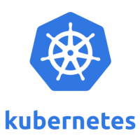

# Docker
Docker provides a way to run applications securely isolated in a container,
packaged with all its dependencies and libraries.

 [](https://hub.docker.com/r/codechecker/codechecker-web)

To see how you can run a CodeChecker server in Docker read the following
sections.

## Table of Contents
* [Build Docker image](#build-docker-image)
* [Pre-built CodeChecker Docker images](#pre-built-codechecker-docker-images)
* [Usage](#usage)
* [Docker compose](#docker-compose)
  * [docker-compose.yml](#docker-composeyml)
    * [Sqlite setup](#sqlite-setup)
    * [PostgreSQL setup](#postgresql-setup)
      * [PostgreSQL (no authentication)](#postgresql-no-authentication)
      * [PostgreSQL (authentication)](#postgresql-authentication)
    * [Running your app](#running-your-app)
* [Kubernetes](#kubernetes)

## Build Docker image
You can create a Docker image by running the following command in the root
directory of this repository:
```bash
docker build -t codechecker-web:latest web/docker
```

Multiple build-time variables can be specified:

- `CC_VERSION` (default: *master*): branch or tag version which will be cloned
from Git. Use `master` if you would like to build an image from the latest
CodeChecker.
- `CC_UID` (default: *950*): id of the *codechecker* user which will be created
during the image build and which will be used to start CodeChecker server.
- `CC_GID` (default: *950*): id of the *codechecker* group which will be
created during the image build.
- `INSTALL_AUTH` (default: *no*): set it to `yes` to install authentication
dependencies like *ldap*.
- `INSTALL_PG8000` (default: *no*): set it to `yes` to install *pg8000*
requirements.
- `INSTALL_PSYCOPG2` (default: *no*): set it to `yes` to install *psycopg2*
requirements.

Example:
```bash
docker build \
  --build-arg INSTALL_AUTH=yes \
  --build-arg INSTALL_PSYCOPG2=yes \
  --tag codechecker-web:latest web/docker
```


## Pre-built CodeChecker Docker images
You can use our pre-built Docker images which can be found in the
[Docker Hub](https://hub.docker.com/r/codechecker/codechecker-web).

## Usage
To run a CodeChecker server docker container use the following command:
```sh
docker run -d \
  -p 8001:8001 \
  -v /home/$USER/codechecker_workspace:/workspace \
  codechecker/codechecker-web:latest
```

## Docker Compose
[Docker Compose](https://docs.docker.com/compose/) is a tool for defining and
running multi-container Docker applications.

### `docker-compose.yml`
CodeChecker server can be easily run by defining the services that make up your
app in `docker-compose.yml` so they can be run together in an isolated
environment.

#### Sqlite setup
To run a simple CodeChecker server with SQLite database you have to
write a compose file similar to
[this](../../web/docker/services/docker-compose.sqlite.yml).

#### PostgreSQL setup

#### PostgreSQL (no authentication)
To run a CodeChecker server and a PostgreSQL database cluster which does not
require authentication you have to write a compose file similar to
[this](../../web/docker/services/docker-compose.psql.yml).

#### PostgreSQL (authentication)
[Docker secrets]((https://docs.docker.com/engine/swarm/secrets/)) can be used
to define the superuser password in the PostgreSQL instance and to define a
`.pgpass` file in the CodeChecker server container for database connections.

Let's create 2 files in your host machine:

- `/home/$USER/codechecker_secrets/postgres-passwd`: this file will
contain the superuser password which will be used in the `initdb` script
during initial container startup. For more information see `Docker Secrets`
section of the official [readme](https://hub.docker.com/_/postgres).
E.g.:
```sh
mkdir -p /home/$USER/codechecker_secrets/ && \
echo 'mySecretPassword' > /home/$USER/codechecker_secrets/postgres-passwd && \
chmod 0600 /home/$USER/codechecker_secrets/postgres-passwd
```
- `/home/$USER/codechecker_secrets/pgpass`: this file can contain
passwords to be used if the connection requires a password. This file should
contain lines of the following format:
`hostname:port:database:username:password`. For more information
[see](https://www.postgresql.org/docs/9.6/libpq-pgpass.html).
E.g.:
```sh
mkdir -p /home/$USER/codechecker_secrets/ && \
echo "*:5433:*:$USER:mySecretPassword" > /home/$USER/codechecker_secrets/pgpass && \
chmod 0600 /home/$USER/codechecker_secrets/pgpass
```

To run a CodeChecker server and a PostgreSQL database cluster which requires
authentication you have write a compose file which should be similar to
[this](../../web/docker/services/docker-compose.psql.auth.yml) and use the
previously created password files for secrets.

### Running your app
Run `docker-compose -f web/docker/services/<service-yml-file> up -d` and
Compose starts and runs your entire app.

## Kubernetes
[](https://kubernetes.io/)

CodeChecker supports to configure liveness, readiness and startup probes for
containers when using
[Kubernetes]( https://kubernetes.io/docs/tasks/configure-pod-container/configure-liveness-readiness-startup-probes/).

If your server is running on `my.company.org` at `8080` port then two URL
endpoints will be available for you:

* `my.company.org:8080/live`: simply say that the server is running. In case of
succes it will response with `200` status code and a
`CODECHECKER_SERVER_IS_LIVE` message.
* `my.company.org:8080/ready`: it will run a simple query on the database. In
case of success it will response with `200` status code and a
`CODECHECKER_SERVER_IS_READY` message. In case of error it will response with
`500` error code and a `CODECHECKER_SERVER_IS_NOT_READY` error message.
