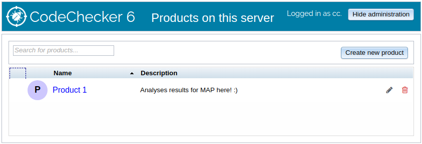

Product management
==================


The product system allows a single CodeChecker server to serve multiple
separate result databases, named "products", under the same IP address and
authentication domain.

`CodeChecker server` takes database arguments to initialize a connection to a
**configuration** database. (See the [User guide](user_guide.md) for
details.) This configuration database contains which products are managed by
the server, and contain various other metadata.

The analysis results are stored in **product** databases. Each product
database is an isolated storage of results, completely separate, and can be
added and removed from a server on the fly.

Command-line tools that are used to access analysis data take an `--url
PRODUCT_URL` parameter, which specifies the access protocol, server host,
port, and the product's unique endpoint in the following format:
`[http[s]://]localhost:8001/Default`, where `Default` is the product's
endpoint. See the [User Guide](user_guide.md#product_url-format) for
further details.

The Web application separates products based on their unique endpoint. The
home page of the server is the product list, shown above.

Table of Contents
=================
* [First start](#first-start)
* [Managing products through the command-line tool, `CodeChecker cmd`](#cmd)
    * [Listing products (`list`)](#listing-products)
    * [Adding new product (`add`)](#adding-new-product)
    * [Delete a product (`del`)](#delete-a-product)
* [Managing products through the web interface](#web-interface)

# First start <a name="first-start"></a>

When a CodeChecker server is started with a SQLite configuration database, and
this database is not yet created (such as when the server is started fresh on
your computer), CodeChecker will automatically set up a `Default` product,
with a SQLite database file next to the configuration database, in
`/home/<username>/.codechecker`.

This does NOT hold true for PostgreSQL configuration backends. These servers,
as PostgreSQL is advanced usage, must be configured manually.

# Managing products through the command-line tool, `CodeChecker cmd` <a name="cmd"></a>

Please see the [User guide](user_guide.md) for overview on the `cmd`
command.

The `products` subcommand of `CodeChecker cmd` group the actions related to
product configuration. All these commands take a server URL (e.g.
`http://localhost:8001`) as their argument, as the commands control a server,
and not an individual product endpoint.

Certain administrative actions regarding products can only be executed by
[superusers](permissions.md), if the server has authentication turned on.

```
usage: CodeChecker cmd products [-h] [--verbose {info,debug,debug_analyzer}]
                                {list,add,del} ...

CodeChecker organises its databases into products. Each product has an
individually configured database which stores the analysis results. These
subcommands are used to manage the products configured by the server. Please
see the individual subcommands for details.

optional arguments:
  -h, --help            show this help message and exit

available actions:
  {list,add,del}
    list                List products available on the server.
    add                 Register a new product to the server.
    del                 Delete a product from the server's products.

common arguments:
  --url SERVER_URL      The URL of the server to access, in the format of
                        '[http[s]://]host:port'. (default: localhost:8001)
  --verbose {info,debug,debug_analyzer}
                        Set verbosity level.

Most of these commands require authentication and appropriate access rights.
Please see 'CodeChecker cmd login' to authenticate.
```

## Listing products (`list`) <a name="listing-products"></a>

```
usage: CodeChecker cmd products list [-h] [--url SERVER_URL]
                                     [-o {plaintext,rows,table,csv,json}]
                                     [--verbose {info,debug,debug_analyzer}]

List the name and basic information about products added to the server.

optional arguments:
  -h, --help            show this help message and exit

common arguments:
  -o {plaintext,rows,table,csv,json}, --output {plaintext,rows,table,csv,json}
                        The output format to use in showing the data.
                        (default: plaintext)
```

## Adding new product (`add`) <a name="adding-new-product"></a>

`add` assigns the unique `PRODUCT_NAME` endpoint with a database connection,
making a new product available on the server.

<details>
  <summary>
    <i>$ <b>CodeChecker cmd products add --help</b> (click to expand)</i>
  </summary>

```
usage: CodeChecker cmd products add [-h] [-n DISPLAY_NAME]
                                    [--description DESCRIPTION]
                                    [--sqlite SQLITE_FILE | --postgresql]
                                    [--dbaddress DBADDRESS] [--dbport DBPORT]
                                    [--dbusername DBUSERNAME]
                                    [--dbpassword DBPASSWORD]
                                    [--dbname DBNAME] [--url SERVER_URL]
                                    [--verbose {info,debug,debug_analyzer}]
                                    ENDPOINT

Create a new product to be managed by the server by providing the product's
details and database connection.

positional arguments:
  ENDPOINT              The URL endpoint where clients can access the analysis
                        results for this product.

optional arguments:
  -h, --help            show this help message and exit
  -n DISPLAY_NAME, --name DISPLAY_NAME
                        A custom display name for the product, which will be
                        shown in the viewer. This is purely for decoration and
                        user experience, program calls use the <ENDPOINT>.
  --description DESCRIPTION
                        A custom textual description to be shown alongside the
                        product.

database arguments:
  NOTE: These database arguments are relative to the server machine, as it
  is the server which will make the database connection.

  --sqlite SQLITE_FILE  Path of the SQLite database file to use. Not absolute
                        paths will be relative to the server's
                        <CONFIG_DIRECTORY>. (default: <ENDOPINT>.sqlite)
  --postgresql          Specifies that a PostgreSQL database is to be used
                        instead of SQLite. See the "PostgreSQL arguments"
                        section on how to configure the database connection.

PostgreSQL arguments:
  Values of these arguments are ignored, unless '--postgresql' is specified!
  The database specified here must exist, and be connectible by the server.

  --dbaddress DBADDRESS, --db-host DBADDRESS
                        Database server address. (default: localhost)
  --dbport DBPORT, --db-port DBPORT
                        Database server port. (default: 5432)
  --dbusername DBUSERNAME, --db-username DBUSERNAME
                        Username to use for connection. (default:
                        <ENDPOINT>)
  --dbpassword DBPASSWORD, --db-password DBPASSWORD
                        Password to use for authenticating the connection.
                        (default: )
  --dbname DBNAME, --db-name DBNAME
                        Name of the database to use. (default: <ENDPOINT>)
```
</details>

## Delete a product (`del`) <a name="delete-a-product"></a>
<details>
  <summary>
    <i>$ <b>CodeChecker cmd token new --help</b> (click to expand)</i>
  </summary>

```
usage: CodeChecker cmd products del [-h] [--url SERVER_URL]
                                    [--verbose {info,debug,debug_analyzer}]
                                    ENDPOINT

Removes the specified product from the list of products managed by the server.
NOTE: This only removes the association and disconnects the server from the
database -- NO actual ANALYSIS DATA is REMOVED. Configuration, such as access
control, however, WILL BE LOST!

positional arguments:
  ENDPOINT              The URL endpoint where clients can access the analysis
                        results for the product.

optional arguments:
  -h, --help            show this help message and exit
```
</details>

# Managing products through the web interface <a name="web-interface"></a>

Certain administrative actions regarding products can only be executed by
[superusers](permissions.md) if the server is running with authentication
turned on.


After enabling the administrative actions in the top right corner, click
*Add new product*, then fill the form presented. The values that need to be
filled here are the same as the arguments for `CodeChecker cmd products add`.

If the product creation is successful, the window will disappear and the
product will appear in the product list.



Editing a product is done through the pencil icon, which is visible when
administrative actions are enabled. This window lets you edit the product's
configuration.

Products can be deleted by clicking on the red trash bin. Deleting a product
corresponds to `CodeChecker cmd products del <product endpoint>`, and as such,
the product is only unmounted from the server (losing access control data and
connection), but **no analysis results are deleted**.
