WEB GUI User Guide
==================

**CodeChecker** is a static analysis infrastructure built on the [LLVM/Clang
Static Analyzer](http://clang-analyzer.llvm.org) toolchain, alternative tool
for [`scan-build`](http://clang-analyzer.llvm.org/scan-build.html) in a Linux
or macOS (OS X) development environment.

<div class="github">More descriptions and guides available
<a href="https://github.com/Ericsson/codechecker/blob/master/docs/README.md">
on GitHub</a>
</div>

Table of Contents
=================

* [Products](#products)
  * [Managing products](#managing-products)
    * [Add new product](#add-new-product)
      * [Disable review status change](#disable-review-status-change)
    * [Edit product configuration](#edit-product-configuration)
    * [Remove a product](#remove-a-product)
  * [Managing permissions](#managing-permissions)
  * [Notification banner](#notification-banner)
* [Runs and history events](#runs-and-history-events)
  * [Runs](#runs)
    * [Show description](#show-description)
    * [Show check command](#show-check-command)
    * [Show analyzer statistics](#show-analyzer-statistics)
    * [Filter runs](#filter-runs)
    * [Compare runs](#compare-runs)
    * [Sorting runs](#sorting-runs)
    * [Delete runs](#delete-runs)
  * [Run history](#run-history)
    * [Compare run history events](#compare-run-history-events)
    * [Filter run history events](#filter-run-history-events)
* [Reports](#reports)
  * [Review status](#review-status)
  * [Detection status](#detection-status)
  * [Severity levels](#severity-levels)
  * [Filtering reports](#filtering-reports)
    * [Date filters](#date-filters)
    * [Regex based filters](#regex-based-filters)
    * [Report count](#report-count)
    * [Remove filtered reports](#remove-filtered-reports)
    * [Clear report filters](#clear-report-filters)
    * [Unique reports](#unique-reports)
  * [Compare mode](#compare-mode)
    * [Compare two different runs](#compare-runs)
    * [Compare two different tagged versions of the same](#compare-tags)
  * [Manage source components](#manage-source-components)
* [Report details](#report-details)
  * [Report navigation tree](#report-navigation-tree)
  * [Button pane](#button-pane)
     * [Report info](#report-info)
     * [Show documentation](#show-documentation)
     * [Change review status](#change-review-status)
  * [Same reports](#same-reports)
  * [Bug path view](#bug-path-view)
  * [Comment](#comment)
* [Statistics](#statistics)
  * [Statistics pages](#statistics-pages)
    * [Product overview](#product-overview)
    * [Checker statistics](#checker-statistics)
    * [Severity statistics](#severity-statistics)
    * [Component statistics](#component-statistics)
  * [Filtering statistics](#filtering-statistics)
    * [Uniqueing checker statistics](#checker-statistics-uniqueing)

# Products
The product system allows a single CodeChecker server to serve multiple
separate result databases, named `products`, under the same IP address and
authentication domain. Each product can be configured to use a separate
database and the access control can be configured separately for each product
by product administrators.

Most of the time a product represents a single GIT repository. For example we
can create separate CodeChecker products for
[postgresql](https://github.com/postgres/postgres),
[curl](https://github.com/curl/curl),
[bitcoin](https://github.com/bitcoin/bitcoin) or
[openssl](https://github.com/openssl/openssl) repositories.

**Note**: comparison and statistics features can be used inside one product and
not between multiple products.

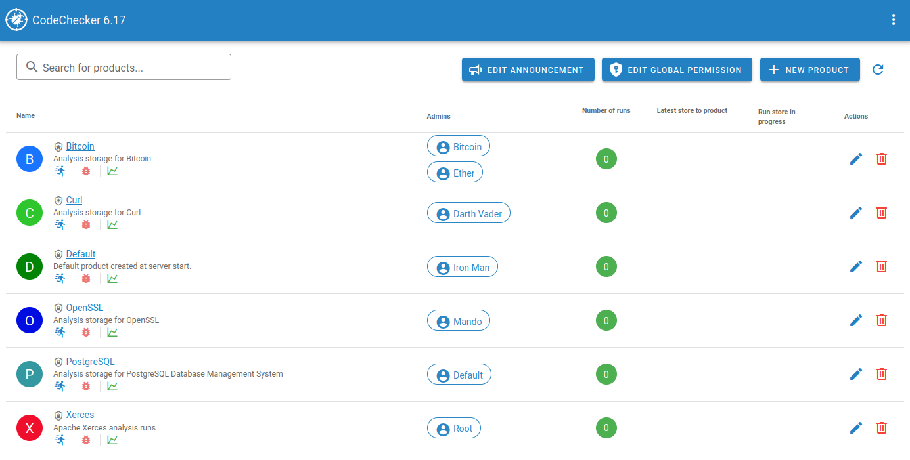

In the product list table you can see the following information:
- `Product name`: display name of the product.
- `Description`: short description of the product.
- `Administrator names`: product admins have the right to allow access for
individual people or LDAP groups. 
- `Number of runs`: number of runs in the product.
- `Latest store to the product`: date of the latest run storage.
- `Run store in progress`: show run names if a storage is in progress.
- `Action buttons` (only for ADMINS): action buttons to edit and remove
products.

**Note**: if you don't have permission for a product and you see the following
message, ask permission from a product admin:

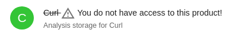

## Managing products
### Add new product
Click to the *NEW PRODUCT* button above the product list table, then fill the
form presented. The values that need to be filled here are the same as the
arguments for `CodeChecker cmd products add`.

**NOTE**: only users with `Super Users` access can add a new product.

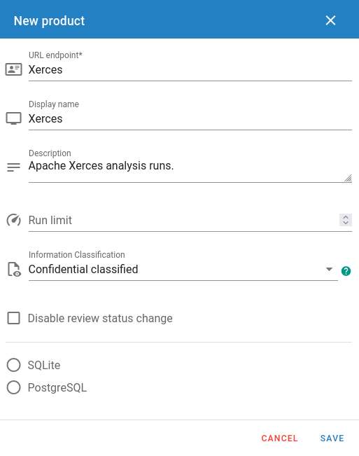

If the product creation is successful, the window will disappear and the
product will appear in the product list.

#### Disable review status change
Review status change can be disabled on the WEB UI to force programmers to use
inline source code comments. This can be configured on the product editing
window by administrators of a product.

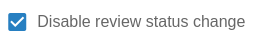

### Edit product configuration
Editing a product configuration is done through the pencil icon which can be
found in the latest *Actions* column of the product list table.

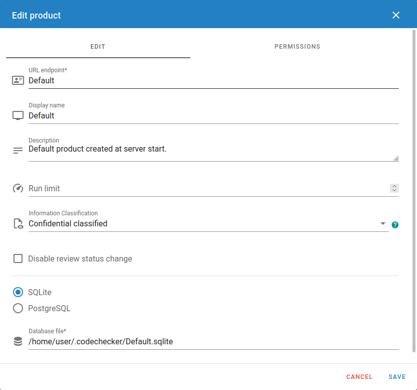

### Remove a product
Products can be deleted by clicking on the red trash bin in the *Actions*
column of the product list table. This way the product is only unmounted from
the server (losing access control data and connection), but
**no analysis results are deleted**. Database needs to be deleted separately.

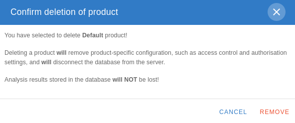

## Managing permissions
* Server-wide permissions can be edited by clicking *EDIT GLOBAL PERMISSION*
button above the product list page. Only users with `Super Users` access can
edit global permissions.
* Product-level permissions can be edited by clicking the edit icon
(blue pencil) for the product you want to configure the permissions.

The two lists show the users and groups known to the system - if a tick is
present in its row, the given user or group has the permission directly
granted. (Users who only have a certain permission through permission
inheritance are not shown with a tick.)


Only the permissions you have rights to manage are shown.

You can edit multiple permissions opening the window only once. Simply tick or
untick the users/groups you want to give the permission to or revoke from them.
Clicking *SAVE* will save the changes to the database.

## Notification banner
There is an option to set a global notification text, that will show on top of
every page below the header bar.

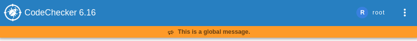

You can edit this alert on the products page with `EDIT ANNOUNCEMENT` button,
but **Super User** permissions are necessary.

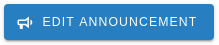

You can remove the current notification by saving an empty text.

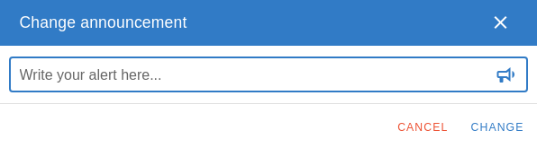

# Runs and history events
## Runs
A run represents subsequent analysis activities for the same source code with
the same analysis settings (checker configurations). We are storing analysis
results to a run within a product:

```sh
CodeChecker store \
  --name master_xerces \
  --url https://my.codechecker.server.com/xerces
  ./reports
```

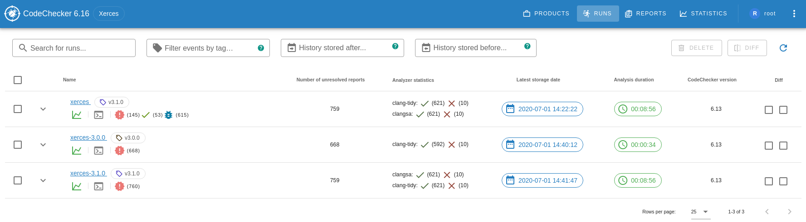

This page contains the analysis runs available on the server under the selected
product.

Each run has the following fields/columns:
- `Delete`: in the first column of the run list table you can select multiple
runs which will be removed by clicking on the *DELETE* button. For more
information [see](#delete-runs).
- `Unique name` which identifies a run. If an already existing run name is
used during the storage, the run will be updated: a new history event will
be created for the run and the detection status will be changed for each
report.
  - `Version tag` (optional): a unique identifier for this individual store of
results in the run's history.
  - `Description` (optional): a custom textual description to be shown alongside
the run. You can find more information how to see the description
[here](#show-description).
  - `Check command` which was used to analyze your project. You can find more
  information how to see the check command [here](#show-check-command).
  - `Detection status counts`: show the number of reports distributed by
  detection statuses.
- `Number of unresolved reports`: number of non unique reports excluding
*Resolved*, *False positive* and *Intentional* reports.
- `Analyzer statistics`: information about the analysis. You can find more
information how to see the analysis statistics
[here](#show-analyzer-statistics).
- `Latest storage date`: latest storage/update date of the run.
- `Analysis duration`: the length of the analysis.
- `CodeChecker version` which was used during the analysis.
- `Diff`: in this column you can select two runs (*baseline* and
*compared to*) which will be compared to each other by click on the *DIFF*
button. For more information [see](#compare-runs).

### Show description
Description is a custom textual description to be shown alongside the run and
given by the `CodeChecker store` command:
```sh
CodeChecker store \
  --name xerces \
  --description "Analysis results of the Xerces-C++ project." \
  --url https://my.codechecker.server.com/xerces \
  ./reports
```

Click on the [i] button beside the run name to show the description.

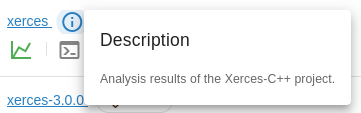

### Show check command
Check/Analyze command is the command which was used to analyze your project:
```sh
CodeChecker analyze \
  -o ./reports \
  -e sensitive \
  ./compilation_database.json
```

Click on the console button under the run name to show the check command.

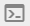

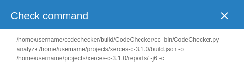

### Show analyzer statistics
Analyzer statistics show the following information for each analyzer
(Clang Static Analyzer, Clang Tidy):
- Analyzer version.
- Number of successfully analyzed files.
- Number of files which failed to analyze.
- List of files which failed to analyze.

Click on the *Analyzer statistics column* to show analyzer statistics for a
run.
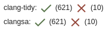

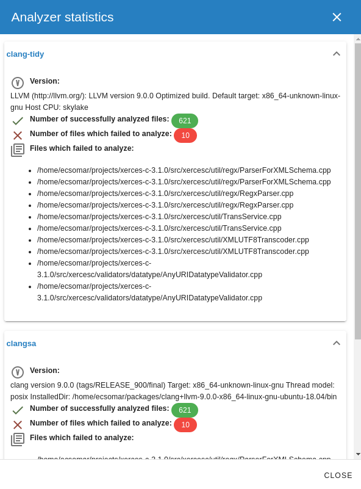

Note that analysis failure may come with incomplete results. Possible reasons
of analysis failure are gcc/clang incompatibility (thus compilation error),
analyzer runtime crash, etc.

### Filter runs
You can filter runs by run name using the input box above the run list table.
The filter is **case insensitive** and does a **substring matching**. If we
start typing some phrase in this input box, the list are being
*filtered automatically*.

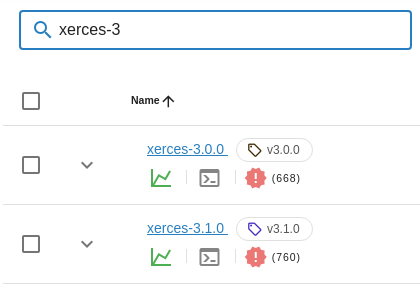

**NOTE**:
- other filters in beside the run name filter can be used to filter
run history events.
- filters will be saved in the URL query parameter list.

### Compare runs
Calculates the difference between two analyses of the project, showing which
reports have been fixed and which are newly introduced.

To compare analysis results you have to do the following:
- select *BASELINE** runs with the first checkbox in the *Diff* column of the
run list table.
- select *COMPARE TO** runs with the second checkbox in the *Diff* column of
the run list table.
- click on the `Diff` button above the run list table.

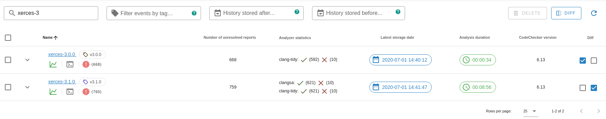

### Sorting runs
It is possible to change the order of the runs by clicking on a cell at the
header of the run list table. For example, you can sort the run list by the
storage date or the run name.

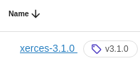

### Delete runs
You can delete multiple runs by selecting them with the checkboxes in the first
column of the run list table and clicking on the `DELETE` button above the run
list table. It will remove the run and all related data from the database.

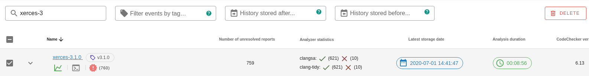

**IMPORTANT**: be careful when you delete a run because this operation can not
be undone.

## Run history
On every run storage event a history event is created for the run. You can
see the history events for a run if you click to the expand arrow (`v` icon)
beside the run name column.

You will see the following information for each history event:
- `Storage date` when the run was stored to the server.
- `User name` who performed the `CodeChecker store` operation.
- `Show statistics` button which can be used to show the statistics for this
history event.
- `Check command` which was used to analyze your project. You can click to the
console style button (`>_` icon) to see the actual check command of the
history event.
- `CodeChecker version` which was used during the analysis.
- `Analyzer statistics`: information about the analysis. You can click to this
section to see the details.

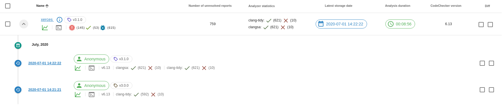

### Compare run history events
Calculates difference between two analyses of the same run storage, showing
which reports have been fixed and which are newly introduced.

To compare analysis history events you have to do the following:
- select *BASELINE** runs with the first checkbox in the *Diff* column of the
run list table for a history event.
- select *COMPARE TO** runs with the second checkbox in the *Diff* column of
the run list table for a history event.
- click on the `Diff` button above the run list table.

### Filter run history events
You can filter run history events with the tag name and storage date input
boxes above the run list table.

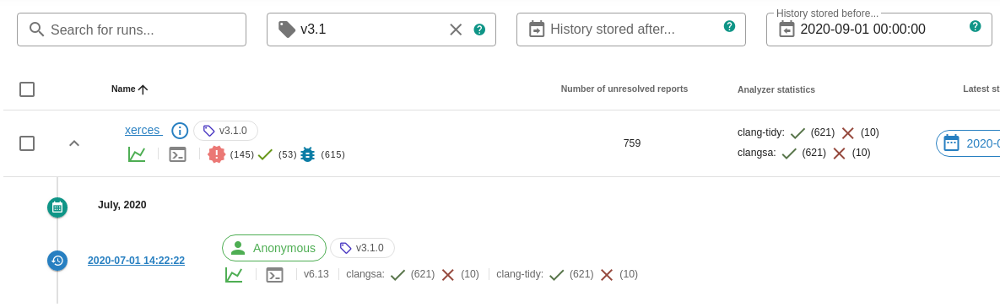

*Note*: the filters will be saved in the URL query parameter list.

# Reports
If you select a run at the [list of runs](#runs) view, you get to this page.
This page lists the analysis result for the given run.

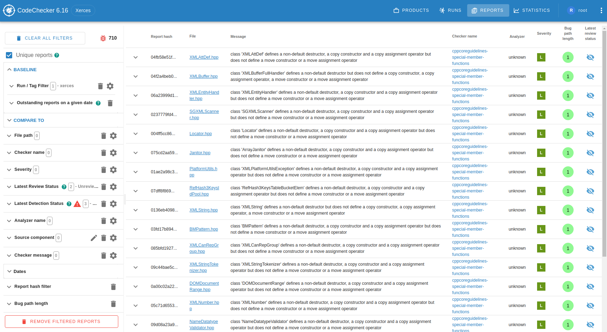

Every report has the following fields:
- `Unique report identifier` (repot hash). You can find more information how
these hashes are generated [here](https://github.com/Ericsson/codechecker/blob/master/docs/analyzer/report_identification.md).
- `File path`: file path where the report is found.
- `Line and column numbers` of the report where the bug is.
- `Checker name` which found the report during the analysis.
- `Checker message`: description about the report.
- `Analyzer name` which found the problem during the analysis.
- [`Severity`](#severity-levels)
- `Bug path length`: length of the bug path. Reports with longer bug path
are more difficult to understand.
- [`Latest review status`](#review-status)
- [`Latest detection status`](#detection-status). This column is visible only
when uniqueing is disabled.
- `Detection date`: the storage date when the report was stored to the server
for the first time. This field is visible only when you hover your mouse over
the *Detection status* icon.
- `Fix date`: storage date when the report is dissapeared from a run update.
This field is visible only when you hover your mouse over the
*Detection status* icon.

## Review status
Reports can be assigned a review status of the following values:
- <span class="customIcon review-status-unreviewed"></span> **Unreviewed**
(_default_): Nobody has seen this report.
- <span class="customIcon review-status-confirmed"></span> **Confirmed**:
This is really a bug.
- <span class="customIcon review-status-false-positive"></span>
**False positive**: This is not a bug. Before marking a bug false positive
you should read the [false positive how to](https://github.com/Ericsson/codechecker/blob/master/docs/analyzer/false_positives.md).
- <span class="customIcon review-status-intentional"></span> **Intentional**:
This report is a bug but we don't want to fix it.

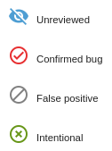


Review statuses are connected to
[report hashes](https://github.com/Ericsson/codechecker/blob/master/docs/analyzer/report_identification.md).
If the same report can be found in multiple runs it will have the same review
status.

It can be changed on the [GUI](#userguide-change-review-status) or by using
[source code comments ](https://github.com/Ericsson/codechecker/blob/master/docs/analyzer/user_guide.md#source-code-comments)
(*codechecker_false_positive*, *codechecker_confirmed*, etc.)

**Note**: source code comment is stronger and can overwrite the value in the
database.

## Detection status
The detection status is the state of a bug report in a run.

- The detection status of a report is connected to the **report ID**. It means
that every report has a separate detection status.
- It will be *calculated automatically* by the server on run storage events
based on the reports in the last storage and the current storage.
- Changing the review status by using source code comments will not affect
the detection status change.

When storing the results of a run from scratch then each report has
detection status <span class="customIcon detection-status-new"></span> **New**.
When the reports stored again with the same run name then the detection status
can change to one of the following options:
- <span class="customIcon detection-status-resolved"></span> **Resolved**: when
the bug report can't be found after the subsequent storage.
- <span class="customIcon detection-status-unresolved"></span> **Unresolved**:
when the bug report is still among the results after the subsequent storage.
- <span class="customIcon detection-status-reopened"></span> **Reopened**: when
a resolved bug appears again.
- <span class="customIcon detection-status-off"></span> **Off**: were reported
by a checker that is switched off during the last analysis which results were
stored.
- <span class="customIcon detection-status-unavailable"></span> **Unavailable**:
were reported by a checker that does not exists anymore because it was removed
or renamed.

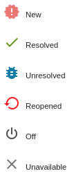

The diagram below shows the detection status transition which may happen when
storing results to the server. For example if the detection status of a report
in the database is **New** the server will change it to **Unresolved**,
**Resolved**, **Off** or **Unavailable** based on the conditions above.


## Severity levels
We are mapping checker names to different severity levels:
- <span class="customIcon icon-severity-critical"></span> **Critical**:
clang-diagnostic-error (compilation error and the analysis was not successful).
- <span class="customIcon icon-severity-high"></span> **High**:
*core.DivideZero*, *core.NullDereference*, *cplusplus.NewDelete*, etc.
- <span class="customIcon icon-severity-medium"></span> **Medium**:
*unix.Malloc*, *core.uninitialized.Assign*, etc.
- <span class="customIcon icon-severity-low"></span> **Low**
*deadcode.DeadStores*, *misc-unused-parameters*, etc.
- <span class="customIcon icon-severity-style"></span> **Style**:
*modernize-raw-string-literal*, *modernize-use-auto*, etc.
- <span class="customIcon icon-severity-unspecified"></span> **Unspecified**:
*android-cloexec-dup*, etc.

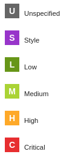

## Filtering reports
When opening the Reports list view on the left sidebar you will see the
following:

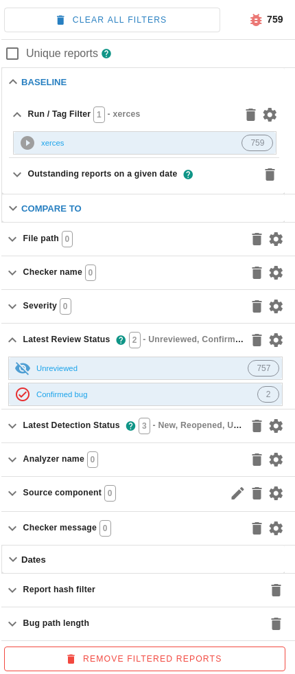

The following filter options are available:
- [`Unique reports`](#unique-reports) - You can uniqueing the reports by
checking this. For more information click [here](#unique-reports).
- **Baseline**
  - `Run / Tag Filter` - You can select one or more run names with tags. The
  result list is restricted on the findings in these runs/tags. By selecting a
  specific run in the *runs* view this field is filled by default.
  When runs are stored in update mode (i.e. on the same run name), then the
  specific runs can be tagged in order to be easier to identify them. By this
  field you can also select the reports found during a specific run event. For
  this you can use the cogwheel button beside each run after hovering on the
  run to specify a tag.
  - `Outstanding reports on a given date` - Filter reports that were
  <i>DETECTED BEFORE</i> the given date and <i>NOT FIXED BEFORE</i> the given
  date.
- [**Compare to**](#diff-mode)
  - `Run / Tag Filter` - Here you can select multiple runs / tags which you
  want to compare against the baseline filter set.
  - `Outstanding reports on a given date` - Here you can select date which
  you want to compare against the baseline filter set.
  - `Diff type` - Here you can set if you'd like to see the reports which
  appear only in the **Baseline**, **Compare to** or both.
- `File path`: You can choose a set of files to restrict the list of bug
reports.
- `Checker name` - If you are interested in specific type of bugs then here
you can choose them.
- [`Severity`](#severity-levels) - The nature of the reports is sorted
in different severity levels. For example, a division by zero or a null pointer
dereference is more serious than an unused variable. By this field you can
select the reports on the given severity levels.
- [`Latest Review Status`](#review-status) - You can select the reports
with the given review status to check only *False positive*, *Unreviewed*, etc.
reports.
- [`Latest Detection Status`](#detection-status) - You can select the
reports with the given detection status to check only *Unresolved*, *Resolved*,
etc. reports.
- `Analyzer name` - If you are interested in specific type of reports which
were detected by an analyzer (Clang Tidy, CppCheck etc.) then here you can
choose them.
- [`Source component`](https://github.com/Ericsson/codechecker/blob/master/docs/web/user_guide.md#source-components) -
Here you can select multiple source components which are named collections of
directories specified as directory filter.
- `Checker message` - The static analysis tools provide a message to indicate
the reason of a specific bug. This message is also filterable.
- **Dates**
  - `Detection date` - Filter reports that were detected between the given
  interval.
  - `Fix date` - Filter reports that were fixed between the given interval.
- `Report hash` - Every report has a unique (hash) identifier called Report
Identifier which can be filtered by using this input box.
- `Bug path length` - A bug path length interval can restrict the list of
displayed bug reports. In these fields you can choose the minimum and maximum
values of bug path length.

Every filter is collapsed by default to save more space in the UI. To expand
the filter and see the selected filter items you can click on the down arrow
(`v` icon) beside each filter name.

### Date filters
Every report has a detection date and a fix date.
- `Detection date`: the storage date when the report was stored to the server
for the first time.
- `Fix date`: storage date when the report is dissapeared from a run update.

Available date filters:
- `Detection date`: get results which were detected between the given dates.
- `Fix date`: get results which were fixed between the given dates.
- `Outstanding reports on a given date`: get results which were
<i>DETECTED BEFORE</i> the given date and <i>NOT FIXED BEFORE</i> the given
date.

### Regex based filters
At `Run / Tag filter`, `File path`, `Checker message` and `Report hash` filters
you can filter the results by using the `*` quantifiers which matches any
number of characters (zero or more). So if you have for example `run_1_a_name`,
`run_2_b_name`, `run_2_c_name`, `run_3_d_name` then `run_2*` will select
`run_2_b_name` and `run_2_c_name`.

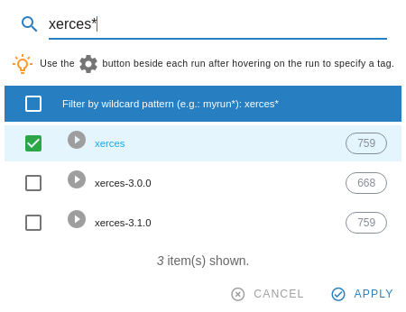

### Report count
When you select a filter option on any field then a number indicates on the
right side of the option the number of reports which belong to that specific
option. If the report count could not be determined this value will be *N/A*.

### Remove filtered reports
Filtered reports can be removed by clicking on the **REMOVE FILTERED REPORS**
button at the bottom of the filter bar.

**!!!WARNING!!!**: once you have removed filtered reports it can not be undone.
Please make sure that you want to remove all filtered results before clicking
on this button.


### Clear report filters
Filter options can be cleared separately by clicking on the trash icon beside
a filter or all filters can be cleared by using *CLEAR ALL FILTERS* button at
the top of the filter bar.

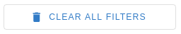


### Unique reports
At the top of the filter panel there is a `Unique reports` checkbox. This
narrows the report list to unique bug (group findings that have the same
*Report Identifier* (report hash) within or across multiple runs).

The same bug may appear several times if it is found on different control
paths, i.e. through different function calls or in multiple runs. By checking
`Unique reports` a report appears only once even if it is found on several
paths.


Reports can be expanded to see all the reports with the same hash by using the
expand arrow (`v` icon) beside the report hash.

**Note**: detection status is not shown in this view and only the file name is
shown because same report may have different detection statuses or can be
found under different file paths.

## Compare mode
In compare mode you can calculate the difference between multiple analyses of
the project, showing which reports have been fixed and which are newly
introduced or which can be fined in all runs.

At the **Baseline** filter section you can select the run names / tags against
which you want to check the difference.

At the **Compare to** filter section you can select the run names / tags which
you want to compare against the *Baseline* runs and run tags.

You can also use the `Outstanding report on a given date` filter to compare
reports by dates.

### Compare two different runs
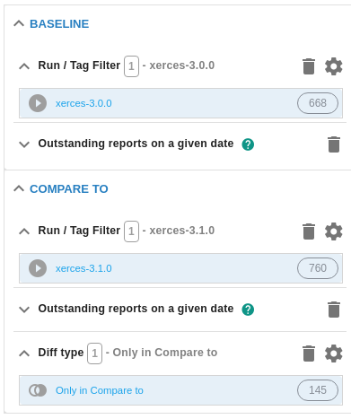

### Compare two different tagged versions of the same
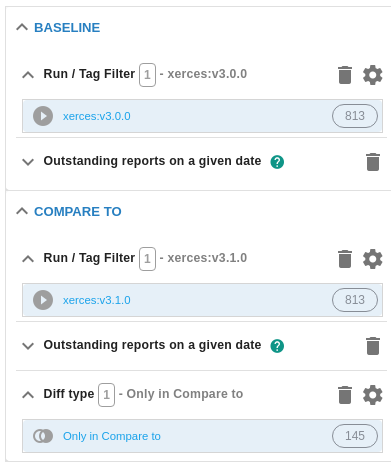

## Manage source components
Source components are named collections of directory filters which can be used
to filter run results (reports) by multiple file paths. Source components
can be managed only by administrators after clicking on the pencil icon at the
Source component filter.

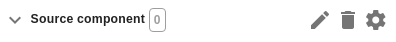

A pop-up window will be opened where you can add, edit or remove existing
source components.


Each line should begin with a `+` or a `-`, followed by a path glob pattern:
- `+`: *ONLY* results from the matching file paths will be listed.
- `-`: results from the matching file paths will not be listed.

For more information [see](https://github.com/Ericsson/codechecker/blob/master/docs/web/user_guide.md#format-of-component-file).

# Report details
## Report Navigation Tree
Report Navigation Tree shows the found reports at the currently opened file.
The reports are grouped by the severity level. You can navigate between them
by clicking on a node in the tree.

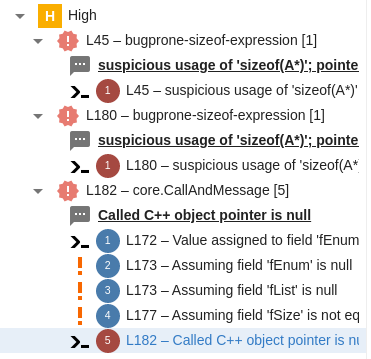

## Button pane
Button Pane contains several items which help you to change or get some
property of the currently opened report.

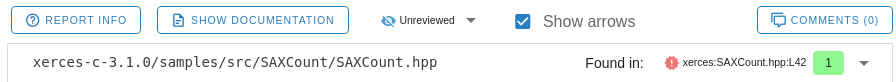

### Report info
`REPORT INFO` button shows detailed information about the currently opened
report such as *Report ID*, *Run name*, *Detection / Fix date* etc.

### Show documentation
`SHOW DOCUMENTATION` button shows the documentation of the actual checker which
identified the currently opened report.


### Change review status
Reports can be assigned a review status of *Unreviewed*, *Confirmed*, *False
positive*, *Intentional* along with an optional comment on why this status was
applied.

It can be changed on the GUI or by using
[source code comments](https://github.com/Ericsson/codechecker/blob/master/docs/analyzer/user_guide.md#source-code-comments)
(*codechecker_false_positive*, *codechecker_confirmed*, etc.)

We can change the review status on the GUI from the default
<span class="customIcon review-status-unreviewed"></span> *Unreviewed* option
to something else in the report details view above the file view.

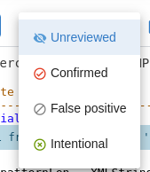

If you changed the review status, you can optionally explain the reason why
you changed it.
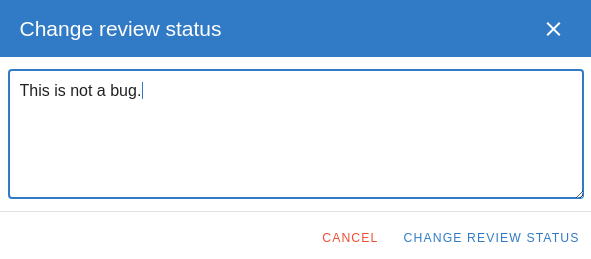

If somebody has already changed the review status from the default one, you can
see extra information (who changed the review status, when and why) beside
the review status selector by hovering on the message icon. This message icon
is hidden by default if nobody has changed the review status.

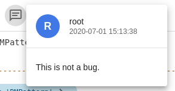

**Note**: source code comments have priority over the value stored in the
database.

## Same reports
Several reports may belong to a specific bug if the bug itself can be reached
on different control paths. With the `Found in` select option you can check
whether the selected report is available on a different path.


## Bug path view
Some checkers are able to follow the execution path along the control flow of
the program. If a bug appears on any of these paths, then CodeChecker is able
to present the full path on which this so called symbolic execution reached the
place of error. This path can be checked in this bug path view.

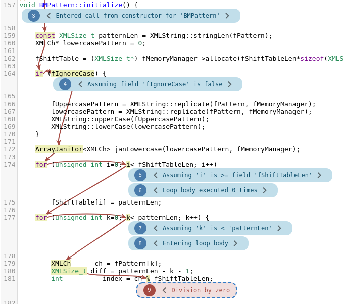

## Comment
There are 2 types of comments:
- `user based` comments.
- `system` comments.

You can add new user comments, edit
(<span class="customIcon edit" style="padding:0px"></span>) and delete
(<span class="customIcon delete" style="padding:0px"></span>) them.

The author of the comment will be the currently logged in user. If the user is
not logged in, the author of the comment will be *Anonymous*.

System comments are automatically generated on the following events:
- on user comment update.
- on review status change.

System comments are cannot be removed.


**Note**: comments are connected to report hashes. This way the comments are
shown for the same report found in multiple runs.

# Statistics

## Statistics pages
Multiple statistics are available inside the GUI:
- [Product overview](#product-overview): overview of the quality status of the
current product.
- [Checker statistics](#checker-statistics): shows the number of reports
grouped by checker names.
- [Severity statistics](#severity-statistics): shows the number of reports
grouped by severity levels.
- [Component statistics](#component-statistics): shows the number of reports
grouped by source components.

### Product overview
This page shows an overview of the quality status of the current product.

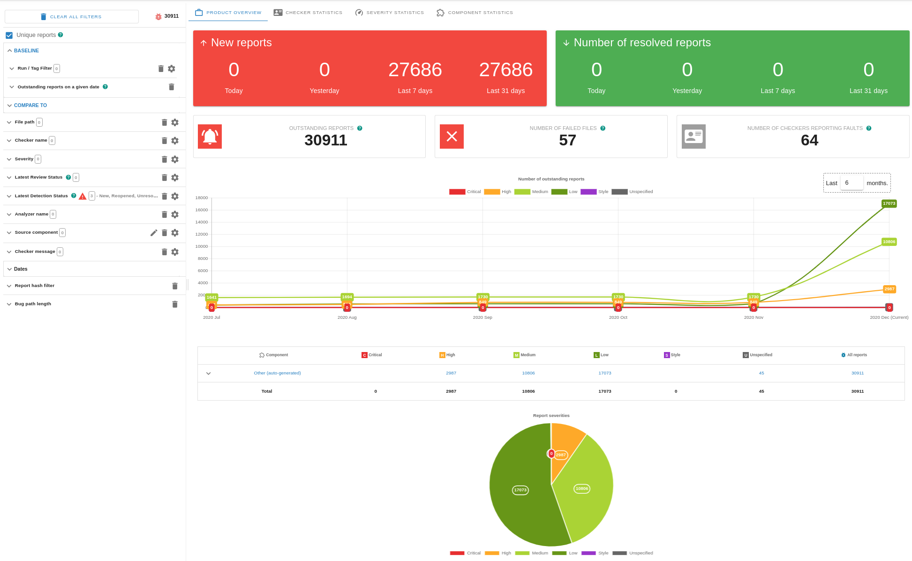

It has the following sections:
- Number of *NEW* reports which were detected `today` / `yesterday` /
`last 7 days` / `last 31 days`.
- Number of *RESOLVED* reports which were detected `today` / `yesterday` /
`last 7 days` / `last 31 days`.
- Number of outstanding reports which are not fixed yet.
- Number of failed files in the current product. If you click to the number it
will show you the list of failed files in a dialog.
- Number of checkers reporting faults.
- Number of outstanding reports chart per severity level. By default it will
show statistics for the last 6 months. You can change it by using the input box
in the top-right corner of this chart.
- Component statistics table grouped by severity levels. Each row can be
expanded which will show a checker statistics for the actual component.

### Checker statistics
Shows the number of reports grouped by checker names.

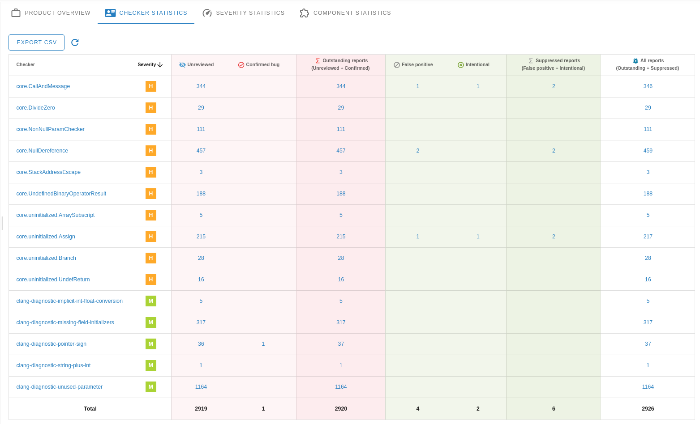

### Severity statistics
Shows the number of reports grouped by severity levels.

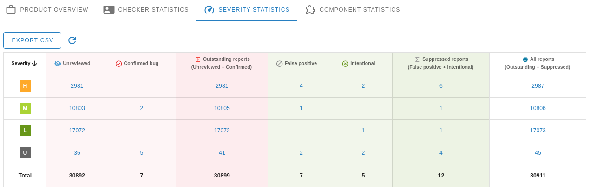

### Component statistics
Shows the number of reports grouped by source components.

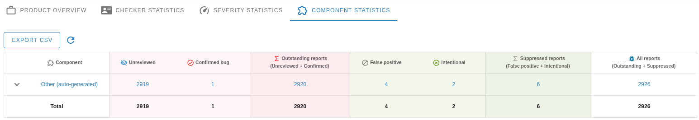

Each row can be expanded by using the `^` button beside the component name. It
will show a checker statistics table for the selected component.


## Filtering statistics
We can get statistics only for specified runs, files, checker names etc. by
using the filter bar.

For more information [see](#filtering-reports)

### Uniqueing checker statistics
The same bug may appear several times if it is found on different execution
paths, i.e. through different function calls. By checking **Unique reports** a
report appears only once even if it is found on several paths.

By default uniqueing is enabled for statistics.

You can find more information how the report hashes are generated
[here](https://github.com/Ericsson/codechecker/blob/master/docs/analyzer/report_identification.md).
